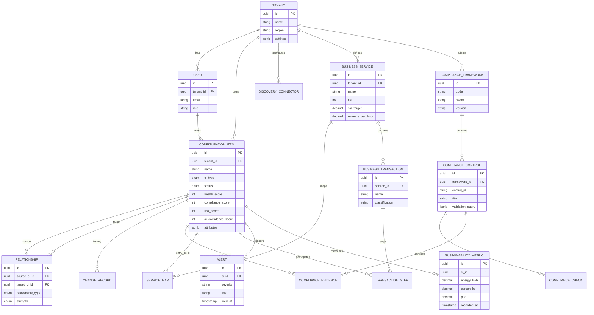

# OpsEdge360 — ER Diagram

## Store Mapping

| Entity Group | Primary Store |
|--------------|---------------|
| Tenant, User, CI, Relationship, Compliance | PostgreSQL |
| Topology graph | Neo4j (synced from CI) |
| Events, raw telemetry | MongoDB |
| Logs, traces, search | OpenSearch |
| Sessions, cache | Redis |

See [DATABASE-DESIGN.md](./DATABASE-DESIGN.md) for full schema.
