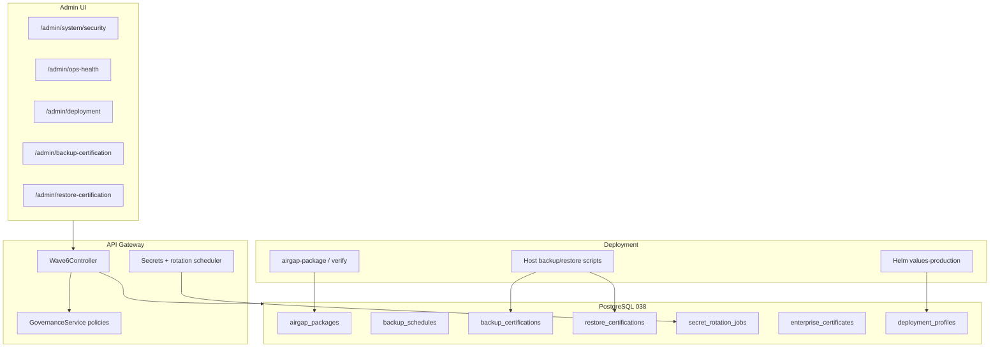

# Wave 6 — Architecture

**Product:** OpsEdge360  
**Release:** `v1.0.0-wave6`  
**Focus:** Enterprise Deployment & Security Hardening (SDS-5.6)

## Scope

Wave 6 adds production deployment packaging and security administration on top of Waves 1–5 without replacing existing HA, backup, governance, or integration surfaces.

## Design principles

1. **Additive only** — no renamed services/tables; Wave 3 security policies remain authoritative for password/session storage.
2. **Honest restore** — destructive restore stays host-side (`scripts/restore-postgres.sh`); APIs record attestations only.
3. **Air-gap honesty** — packaging/verification works offline; full offline install requires images present in a local registry.
4. **No silent auto-rotate** — `SECRETS_AUTO_ROTATE=true` required for scheduler-driven rotation.
5. **No GA claim** — `gaClaim: false` until Phase 5 exit.

## Components delivered

| Area | Artifact |
|------|----------|
| Migration | `038_wave6_enterprise_deployment.sql` |
| APIs | `/admin/ops-health`, `/admin/system/security/*`, `/admin/deployment/*` |
| Helm | `infra/helm/opsedge360` + `values-production.yaml` |
| Scripts | `airgap-package.sh`, `airgap-verify.sh`, `backup-certify.sh`, `backup-redis-meta.sh` |
| UI | System Security, Ops Health, Deployment, Backup/Restore certification |
| Validation | `P5_WAVE6_VALIDATION_OK` |
