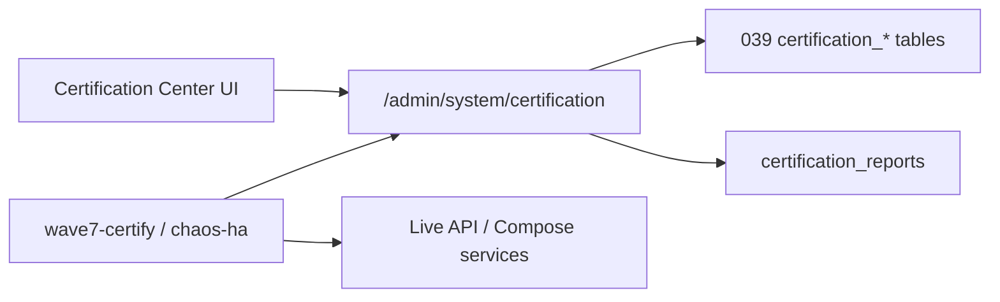

# Wave 7 — Architecture

**Release:** `v1.0.0-wave7`  
**Purpose:** Certify Waves 1–6 under production architecture (no new product features).

Suites: performance, load, ha, chaos, security, scalability, operational, reliability, reports.
