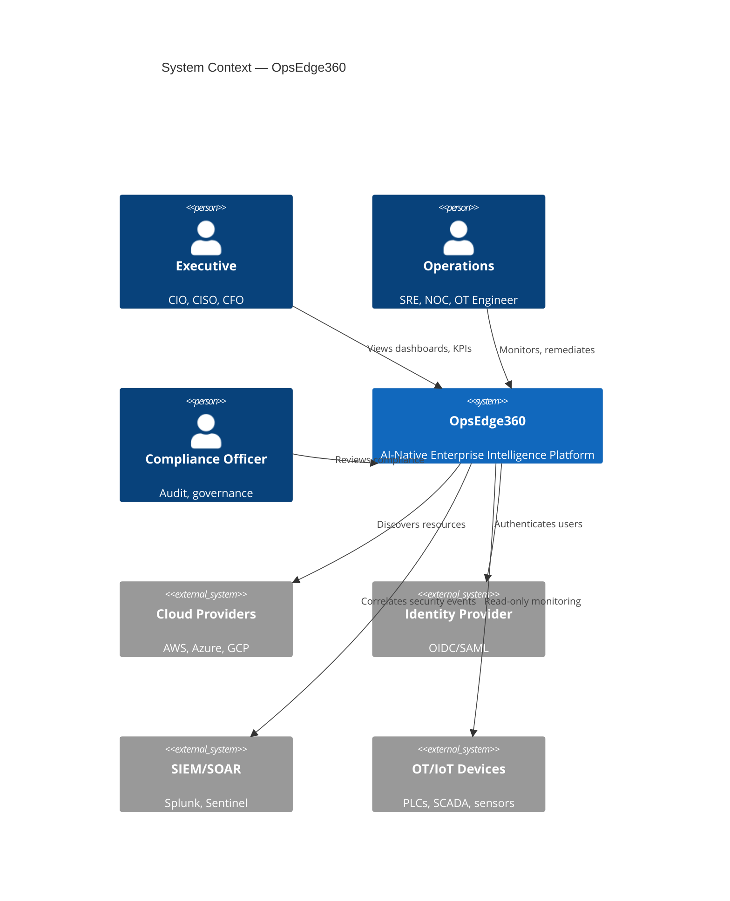
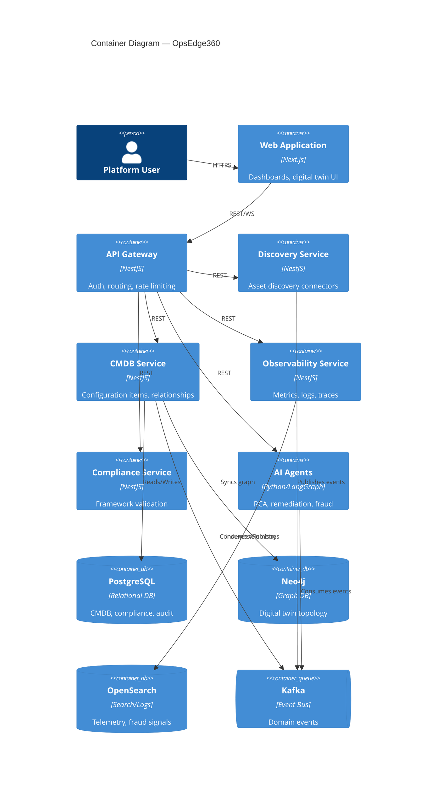
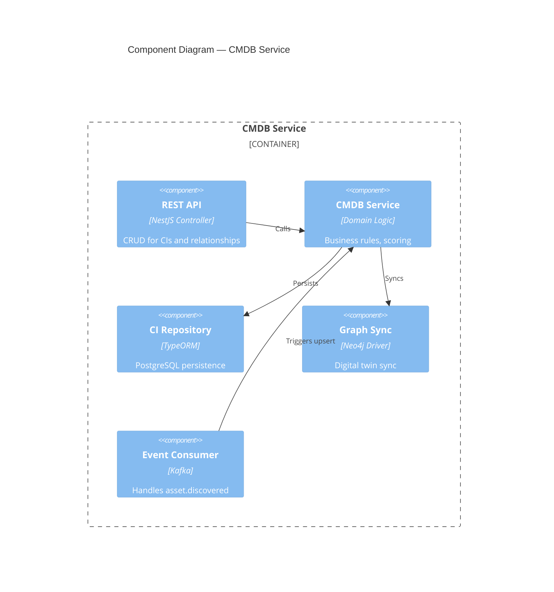
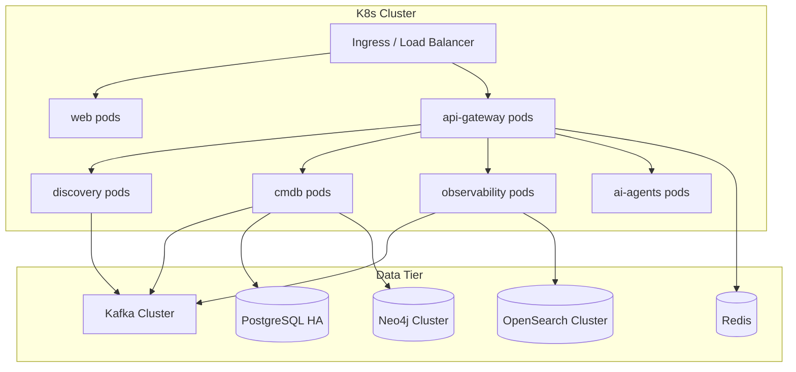

# OpsEdge360 — C4 Architecture Diagrams

**Version:** 1.0

---

## Level 1: System Context



## Level 2: Container Diagram



## Level 3: CMDB Service Components



## Level 4: Discovery Connector (Code)

```
services/discovery/src/
├── connectors/
│   ├── ssh.connector.ts      # Linux/Unix discovery
│   ├── snmp.connector.ts     # Network devices
│   ├── kubernetes.connector.ts
│   └── aws.connector.ts
├── discovery.service.ts      # Orchestration
├── discovery.controller.ts   # REST API
└── events/
    └── asset.publisher.ts    # Kafka producer
```

## Deployment View



---

*Diagrams use Mermaid C4 extension syntax. Render in GitHub, VS Code, or Mermaid Live Editor.*
