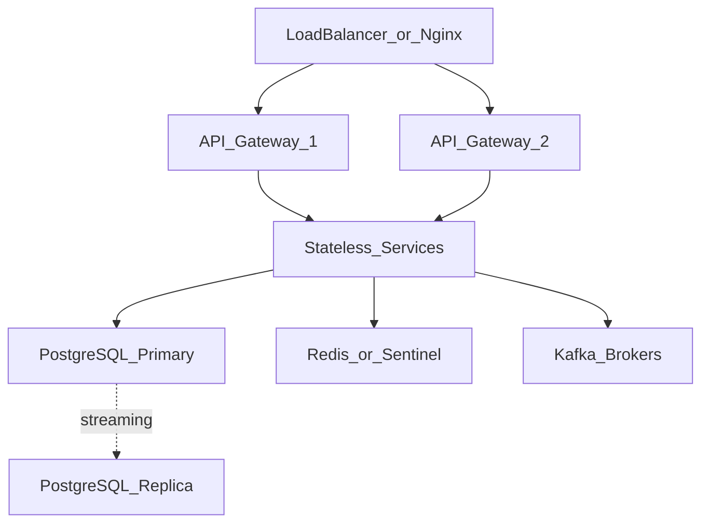

# High Availability Architecture

**Wave:** Phase 5 / Wave 2 (`v1.0.0-wave2`)  
**Status:** Foundation ready — live multi-node is operator-enabled

## Patterns

| Component | Pattern |
|-----------|---------|
| API Gateway / Web / microservices | Active/Active horizontal scale |
| PostgreSQL | Active/Passive streaming replication |
| Redis | Standalone or Sentinel |
| Kafka | Multi-broker RF≥3 when clustered |

## Artifacts

- `docker-compose.ha.yml`
- `infra/helm/opsedge360` (+ `values-ha.yaml`)
- Admin probes: `GET /api/v1/admin/ha`

## Honesty

Current production VPS may remain single-node (`topologyMode=single_node_ha_ready`) while HA configs and APIs are validated. Set `HA_MULTI_NODE=true` when multi-replica is actually running.
