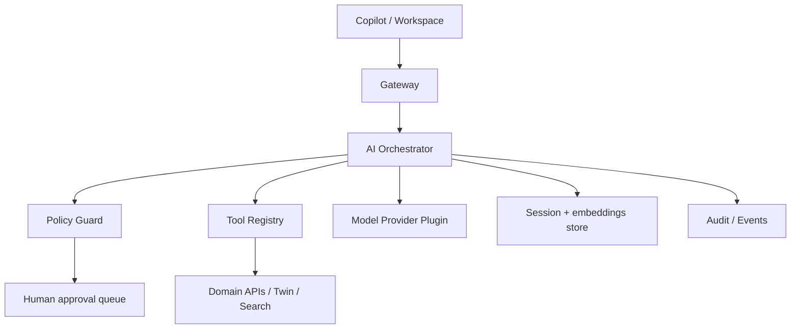

# OpsEdge360 — AI Architecture

**Document ID:** OE360-AI-P1-001  
**Phase:** 1  
**Parent:** [OPSEDGE360_ENTERPRISE_ARCHITECTURE.md](./OPSEDGE360_ENTERPRISE_ARCHITECTURE.md)  
**Alignment:** ADR-021 / existing AI notes; this doc is Phase 1 product SSOT

---

## 1. Principles

1. **AI assists; humans approve** high-impact actions  
2. **Grounded answers** — cite OpsEdge APIs/DB evidence  
3. **Tenant-scoped** — no cross-tenant retrieval  
4. **Provider-pluggable** — models behind AI Provider plugin  
5. **Observable** — every recommendation audited  
6. **Honest UX** — advisory labeling; confidence shown  

---

## 2. Capability map

| Capability | Description | Risk tier |
|------------|-------------|-----------|
| AI Copilot | Chat + tools over live estate | Low–Med |
| AI Root Cause Analysis | Hypotheses from signals + topology | Med |
| AI Alert Correlation | Group related alerts | Med |
| AI Incident Summary | Timeline narrative | Low |
| AI Recommendations | Next best actions | Med |
| AI Automation | Propose runbooks / fill params | High (gated) |
| AI Capacity Planning | Forecast saturation | Med |
| AI Cost Optimization | Waste / rightsizing suggestions | Med |
| AI Executive Reports | Draft narrative from KPIs | Low |
| Natural Language Search | NL → structured search/query | Low |
| Knowledge Assistant | KB / runbook Q&A | Low |
| Runbook Assistant | Generate/adapt runbooks | High (gated) |

---

## 3. Logical architecture



---

## 4. Tooling model

Tools are **versioned OpsEdge functions**, e.g.:

- `search.entities`  
- `twin.impact`  
- `incident.get` / `incident.summarize`  
- `security.findings.list`  
- `observe.metrics.query`  
- `automation.propose`  
- `report.draft`  

No tool may call SkyWalking/Wazuh/etc. directly — only domain APIs/adapters.

---

## 5. RCA & correlation

| Stage | Behavior |
|-------|----------|
| Collect | Alerts, deploys, twin neighbors, recent changes, security findings |
| Hypothesize | Ranked hypotheses with evidence spans |
| Explain | Human-readable summary + confidence |
| Act | Suggest verify steps / runbooks — execution gated |

Outputs attach to Incident Workspace.

---

## 6. Automation safety

```text
Propose → Policy check → Dry-run → Human approve → Execute → Verify → Learn
```

Denied by default when: production criticality high, SoD fail, license missing, or confidence below threshold.

---

## 7. Data & privacy

- Prompts include only tenant-authorized context  
- PII minimization / redaction hooks  
- Optional customer-managed keys / private model endpoints  
- Retention policies for chat & embeddings  

---

## 8. Events

Emit: `ai.recommendation.generated`, `ai.rca.completed`, `ai.copilot.tool_invoked`, `ai.automation.proposed`

---

## 9. Pack extensibility

Solution packs register **skills** (prompt packs + tools + dashboards) without core changes — e.g., Banking360 payment-journey RCA skill.

---

## 10. Out of scope for Phase 1 implementation

Full agentic auto-remediation without gates; training custom foundation models. Phase 1 **designs** the architecture only.
