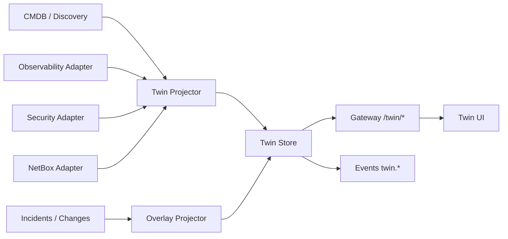

# OpsEdge360 — Digital Twin Architecture (Flagship)

**Document ID:** OE360-TWIN-P1-001  
**Phase:** 1  
**Parent:** [OPSEDGE360_ENTERPRISE_ARCHITECTURE.md](./OPSEDGE360_ENTERPRISE_ARCHITECTURE.md)  
**Related:** existing notes in `15-DIGITAL-TWIN-ARCHITECTURE.md` (this Phase 1 doc is delivery SSOT)

---

## 1. Vision

The Digital Twin is the **living enterprise graph** connecting business services to technology, risk, security, and operations — the flagship differentiator versus point tools.

Everything important **connects visually**: business → apps → infra → cloud → K8s → network → security → health → KPIs.

---

## 2. Twin domains

| Domain | Examples |
|--------|----------|
| Business | BusinessService, Journey, SLO, Owner, Region |
| Applications | Application, API, Microservice |
| Infrastructure | Host, VM, Cluster, Container, Pod |
| Data | Database, Queue, Cache, Bucket |
| Cloud | Account, VPC, Function, ManagedService |
| Network | Device, Link, Firewall, LB, Circuit |
| Security | Control, Finding, Policy |
| Operations | Incident, Change, AutomationRun (overlays) |
| Risk / Health | Scores, blast radius, drift markers |

---

## 3. Graph model

### Node kinds (canonical)

`BusinessService`, `Application`, `ServiceInstance`, `Host`, `Cluster`, `Container`, `Pod`, `Database`, `Queue`, `CloudResource`, `NetworkDevice`, `SecurityControl`, `Person`, `Team`, `Location`, `ComplianceControl`

### Relationship kinds

`DEPENDS_ON`, `RUNS_ON`, `CALLS`, `CONNECTS_TO`, `ROUTES_TO`, `SECURED_BY`, `OWNED_BY`, `LOCATED_IN`, `PART_OF`, `BACKED_BY`, `EXPOSES`

### Node payload (minimum)

```json
{
  "id": "uuid",
  "tenantId": "uuid",
  "kind": "Application",
  "name": "Payment API",
  "healthScore": 82,
  "riskScore": 35,
  "status": "degraded",
  "criticality": "tier1",
  "owners": ["team:payments"],
  "sources": ["cmdb", "observe", "netbox"],
  "updatedAt": "ISO-8601"
}
```

---

## 4. Views

| View | Audience | Emphasis |
|------|----------|----------|
| Executive | CIO/CTO | Business services, risk, impact $ / SLO |
| Operator | SRE | Dependencies, health, recent changes |
| Security | SecOps | Findings overlay, blast from threat |
| AI | Copilot | Highlighted causal paths + confidence |
| Drift | Platform | Config drift markers |
| Impact simulation | All | What-if blast radius |

---

## 5. Data pipeline



Rules:

- CMDB is structural source of truth for CI identity  
- Adapters enrich — they do not invent conflicting identities without reconciliation  
- Overlays (incidents, findings) are ephemeral layers  

---

## 6. Capabilities

| Capability | Description |
|------------|-------------|
| Graph rendering | Progressive load; filter by kind/criticality |
| Dependency engine | Traversal with depth/direction controls |
| Blast radius | Downstream/upstream impact from seed node |
| Impact simulation | Hypothetical node/rel failure |
| Configuration drift | Overlay vs baseline |
| Owner mapping | Team/person from CMDB |
| Topology overlay | Observe/network layers |
| Business KPIs | SLO / journey health on service nodes |
| Never empty | Demo/enterprise packs guarantee seed graph |

---

## 7. APIs (product)

| API | Purpose |
|-----|---------|
| `GET /twin/graph` | Nodes/edges projection |
| `GET /twin/nodes/{id}` | Detail + neighbors |
| `POST /twin/impact` | Blast radius / simulation |
| `GET /twin/drift` | Drift markers |
| `GET /twin/owners/{id}` | Ownership |

Contracts are **OpsEdge**, independent of Neo4j vs Postgres-graph vs other store.

---

## 8. UX principles (Twin-specific)

- One canvas, contextual inspector  
- Health color + risk ring semantics shared with Command Center  
- Click → inspector → actions (incident, automation, observe)  
- No third-party topology product branding  

---

## 9. Non-functional

| Concern | Target |
|---------|--------|
| Interactive graph | p95 &lt; 2s for ≤ 500 nodes projection |
| Full estate | Aggregated / clustered beyond threshold |
| Consistency | Eventual; show `asOf` timestamp |
| Multi-tenant | Strict partition |

---

## 10. Build vs integrate

| Native | Via adapters |
|--------|----------------|
| Twin model, UX, simulation, overlays | SkyWalking topology signals, Wazuh inventory, NetBox DCIM/IPAM, GLPI assets |
