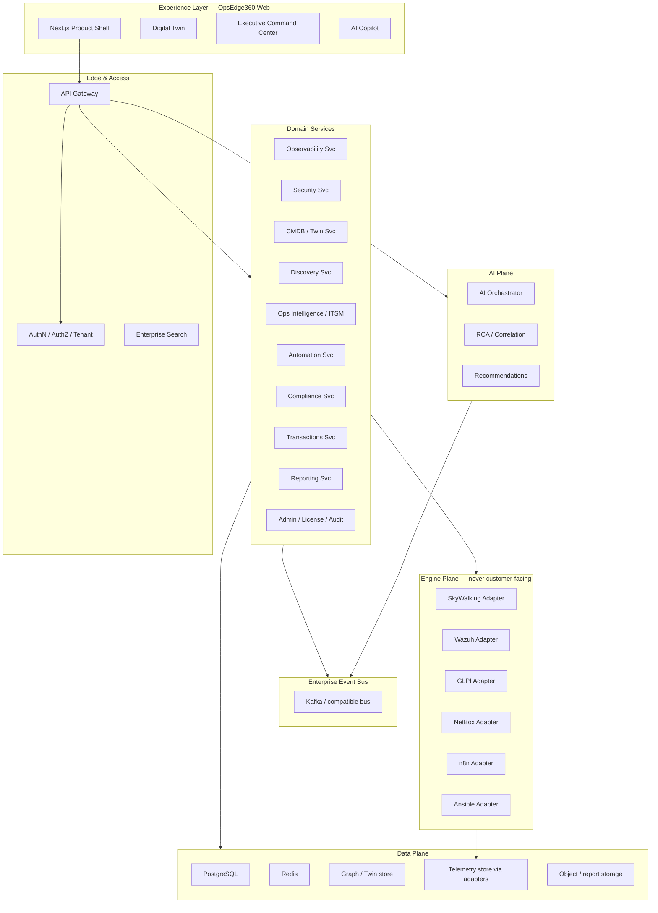

# OpsEdge360 — Enterprise Solution Architecture

**Document ID:** OE360-ESA-P1-001  
**Phase:** 1 — Enterprise Architecture & Product Foundation  
**Status:** Blueprint (implementation-ready SSOT for future development)  
**Date:** 2026-07-13  
**Product:** OpsEdge360 · Powered by AsoftechInsightz  
**Supersedes for delivery planning:** Fragmented architecture notes where conflicting; aligns with `docs/governance/FROZEN_PRODUCT_VISION.md`  
**Inputs:** Phase 0 research (`workspace/research/`), RC1 product baseline, existing gateway/services

---

## 1. Executive Summary

OpsEdge360 is an **Enterprise Digital Operations Intelligence Platform** — not an observability tool alone.

It unifies observability, security operations, CMDB/digital twin, ITSM foundations, automation, compliance, AI-assisted operations, and executive command into **one branded product experience**.

Internally, best-of-breed engines may power domains (SkyWalking, Wazuh, GLPI, NetBox, n8n, Ansible). Externally, customers never see those products. They experience only **OpsEdge360**.

This document is the **single source of truth** for enterprise architecture across SaaS, hybrid, and on-premises deployments, and for industry solution packs (Banking360, Retail360, Healthcare360, Manufacturing360, Government360) without core redesign.

---

## 2. Product Vision

> One modular platform that discovers, observes, secures, and governs enterprise operations — with AI-assisted insight and automation — while remaining industry-agnostic at the core and extensible through solution packs and plugins.

### Competitive frame (inspiration only — do not clone)

| Class | Reference category |
|-------|-------------------|
| Observability | Dynatrace, Datadog, AppDynamics, Grafana Enterprise |
| Security analytics | Splunk Enterprise class |
| ITOM / ITSM | ServiceNow ITOM / ITSM class |

OpsEdge360 **combines architectural concepts** into a premium unified experience; it does not rebrand open-source UIs.

### Non-negotiable product principle

| Rule | Meaning |
|------|---------|
| Single product | One shell, one IA, one auth, one search, one brand |
| Abstraction | UI and public APIs never call engines directly |
| No fork | Do not fork/rebrand/modify upstream unless absolutely required |
| Engines are details | SkyWalking/Wazuh/GLPI/NetBox/n8n/Ansible are replaceable adapters |

---

## 3. Design Principles

| # | Principle | Implication |
|---|-----------|-------------|
| 1 | Product over stack | Customer sees OpsEdge360 only |
| 2 | API-first | All capabilities available via versioned APIs |
| 3 | Event-driven | Domain events on enterprise bus |
| 4 | Multi-tenant by default | Logical isolation; optional dedicated stacks |
| 5 | Zero-trust ready | mTLS, least privilege, audit everywhere |
| 6 | AI-assisted, human-gated | Recommendations + policy-approved automation |
| 7 | Twin-centric | Business services and dependencies are first-class |
| 8 | Pack-extensible | Verticals as packs; core stays industry-agnostic |
| 9 | Plug-in extensible | New engines via adapters without core rewrites |
| 10 | Deploy anywhere | SaaS · Hybrid · On-prem with same architecture |

---

## 4. High-Level Architecture



---

## 5. Layered Architecture

| Layer | Responsibility | Customer-visible? |
|-------|----------------|-------------------|
| **Experience** | Screens, widgets, journeys, branding | Yes |
| **BFF / Gateway** | Aggregation, auth, RBAC, rate limits, contracts | Indirect (API) |
| **Domain services** | Business logic, workflows, policies | Via APIs |
| **AI plane** | Copilot, RCA, correlation, NL search | Via OpsEdge UX |
| **Event bus** | Async integration, fan-out, audit hooks | No |
| **Data plane** | OLTP, cache, twin graph, artifacts | No |
| **Engine adapters** | Translate OpsEdge models ↔ engines | No |
| **Infrastructure** | K8s, mesh, secrets, observability of platform | Ops only |

---

## 6. Microservices Architecture

### Current / target service map

| Service | Role |
|---------|------|
| `api-gateway` | Single front door; dashboard aggregator; adapter orchestration |
| `discovery` | Asset / service discovery pipelines |
| `cmdb` | Configuration items, relationships, topology APIs |
| `observability` | Metrics/logs/traces façade (backed by adapters) |
| `security` | Findings, posture, SIEM façade |
| `compliance` | Controls, evidence, frameworks |
| `transactions` | Business transaction / journey telemetry |
| `ops-intelligence` | Incidents, RCA, remediation workflows |
| `automation` | Runbook orchestration façade |
| `reporting` | Report generation / export |
| `ai-orchestrator` | Copilot tools, summaries, recommendations |
| `twin-sync` | Graph projection workers |
| `notification` | Channels (email, webhook, chat) |
| `license` | Entitlements, packs, metering |

Services communicate via **synchronous APIs (internal)** and **asynchronous domain events**. UI never bypasses the gateway for engine calls.

---

## 7. API Gateway

Responsibilities:

- TLS termination (with edge proxy)
- Authentication (OIDC / SAML / local / API tokens)
- Authorization (RBAC + tenant context)
- Request aggregation (e.g., executive dashboard)
- Contract versioning (`/api/v1`, future `/api/v2`)
- Rate limiting, quotas, abuse protection
- Idempotency keys for mutating ops
- Audit emission for sensitive actions
- Adapter routing (never expose engine URLs)

Public surface is **OpsEdge360 APIs only**.

---

## 8. Authentication

| Method | Use |
|--------|-----|
| OIDC / OAuth2 | Enterprise IdP (Entra, Okta, Keycloak) |
| SAML 2.0 | Legacy enterprise SSO |
| Local + MFA | Break-glass / SMB |
| API tokens / mTLS | Service and partner integrations |
| Demo enter tokens | Controlled demo tenancy (EDE) |

Tokens carry: `tenantId`, `orgId`, `roles`, `packs`, `sessionId`.

---

## 9. Authorization (RBAC)

- Role-based + optional ABAC attributes (site, BU, criticality)
- Permission catalog scoped by module (`twin:read`, `incident:write`, `automation:execute`, …)
- Separation of duties for remediation approve vs execute
- Pack entitlements gate module visibility
- All denials audited

See Information Architecture doc for role matrix.

---

## 10. Multi-Tenant Architecture

| Isolation mode | Description |
|----------------|-------------|
| Shared (default SaaS) | Shared compute; row-level `tenant_id`; encrypted secrets per tenant |
| Dedicated DB schema / DB | Higher-tier isolation |
| Dedicated stack | Regulated / sovereign customers |

Hard rules:

- No cross-tenant queries without platform-admin break-glass
- Twin graph, search index, and event topics are tenant-partitioned
- Engine credentials stored per tenant in vault

---

## 11. SaaS Architecture

- Regional control planes + data planes
- Central identity & licensing
- Shared Kafka / Postgres with tenant isolation
- Autoscaling gateway and workers
- Continuous delivery with canary / blue-green
- Customer-facing status page + platform health APIs

---

## 12. Hybrid Architecture

- Customer edge collectors / agents remain on-prem
- Sensitive telemetry may stay in customer VPC
- Control plane (policies, UX, twin metadata) in OpsEdge SaaS **or** fully private
- Secure egress: private link / site-to-site / mTLS reverse connectors
- Adapters may run in customer network targeting local SkyWalking/Wazuh/NetBox

---

## 13. On-Prem Architecture

- Same container images as SaaS
- Customer-managed IdP, Postgres, Redis, Kafka (or bundled profiles)
- Air-gap profile: offline license, signed images, no phone-home except optional telemetry
- Engine plane deployable alongside or pointing to existing customer instances

---

## 14. High Availability

| Tier | Target |
|------|--------|
| Gateway / web | N+1, multi-AZ |
| Domain services | Stateless replicas |
| Postgres | Primary + sync replica / managed HA |
| Redis | Sentinel / managed |
| Kafka | 3+ brokers |
| Twin graph | HA per chosen store |
| Engines | Follow upstream HA guides via adapters |

Health endpoints: `/health`, `/ready`, `/live` — already part of production baseline.

---

## 15. Disaster Recovery

| Item | Policy (blueprint) |
|------|--------------------|
| RPO | Tiered: ≤ 15 min metadata; telemetry per retention SKU |
| RTO | Tiered: ≤ 1–4 h depending on deployment |
| Backups | Automated DB + object store + config |
| Runbooks | Documented restore; chaos certification suites |
| Cross-region | Optional for SaaS enterprise SKUs |

---

## 16. Scalability

- Horizontal scale of gateway and workers
- Partitioned event consumption by tenant/domain
- Telemetry cardinality controls at adapter boundary
- Twin graph projections incremental, not full rebuild
- Search indexing async
- Report generation queued

Designed to support large estates (thousands of services, tens of thousands of CIs) and solution-pack overlays without redesign.

---

## 17. Security Model

- Zero-trust service mesh path (mTLS between services)
- Secrets in vault; never in logs
- Encryption in transit and at rest
- Continuous audit of authz, automation, config changes
- Vulnerability & FIM signals via Security adapter (Wazuh)
- Secure SDLC: SAST/DAST, signed artifacts, SBOM
- Residual risk acceptance documented per release (see RC1 known issues pattern)

---

## 18. Integration Model

```text
UI → Gateway Contract → Domain Service → Adapter Interface → Engine
                              ↓
                         Domain Events
```

| Engine | Adapter responsibility |
|--------|------------------------|
| SkyWalking | Traces, metrics, topology, OTel bridge |
| Wazuh | Agents, FIM, vuln, SCA, alerts |
| GLPI | Tickets, assets, inventory sync |
| NetBox | DCIM/IPAM SoT sync |
| n8n | Workflow trigger/status |
| Ansible | Playbook execution façade (via runner/AWX) |

Adapters implement a **stable OpsEdge interface**; engines are swappable.

Detailed design: `OPSEDGE360_INTEGRATION_ARCHITECTURE.md`, `OPSEDGE360_PLUGIN_FRAMEWORK.md`.

---

## 19. Deployment Profiles

| Profile | Engines | Notes |
|---------|---------|-------|
| Full Enterprise | All adapters enabled | Default target |
| Obs + Twin | SkyWalking + native twin | Mid-market start |
| SecOps | Wazuh + native incident | Security-led |
| ITOM | NetBox + GLPI + Ansible | Ops-led |
| Air-gap | Bundled minimal engines | Regulated |

---

## 20. Solution Pack Extensibility

Core remains industry-agnostic. Packs add:

- Domain models & KPIs
- Dashboards & report templates
- Compliance control packs
- Demo estates (e.g., Banking360 / EDE)
- Copilot skills

Packs **must not** fork core architecture.

---

## 21. Related Phase 1 Documents

| Topic | Document |
|-------|----------|
| Modules | [OPSEDGE360_PRODUCT_MODULES.md](./OPSEDGE360_PRODUCT_MODULES.md) |
| Screens | [OPSEDGE360_SCREEN_ARCHITECTURE.md](./OPSEDGE360_SCREEN_ARCHITECTURE.md) |
| Information architecture | [OPSEDGE360_INFORMATION_ARCHITECTURE.md](./OPSEDGE360_INFORMATION_ARCHITECTURE.md) |
| UX principles | [OPSEDGE360_UX_DESIGN_PRINCIPLES.md](./OPSEDGE360_UX_DESIGN_PRINCIPLES.md) |
| Digital Twin | [OPSEDGE360_DIGITAL_TWIN_ARCHITECTURE.md](./OPSEDGE360_DIGITAL_TWIN_ARCHITECTURE.md) |
| AI | [OPSEDGE360_AI_ARCHITECTURE.md](./OPSEDGE360_AI_ARCHITECTURE.md) |
| Integration | [OPSEDGE360_INTEGRATION_ARCHITECTURE.md](./OPSEDGE360_INTEGRATION_ARCHITECTURE.md) |
| Plugins | [OPSEDGE360_PLUGIN_FRAMEWORK.md](./OPSEDGE360_PLUGIN_FRAMEWORK.md) |
| APIs | [OPSEDGE360_ENTERPRISE_APIS.md](./OPSEDGE360_ENTERPRISE_APIS.md) |
| Events | [OPSEDGE360_EVENT_ARCHITECTURE.md](./OPSEDGE360_EVENT_ARCHITECTURE.md) |
| Data model | [OPSEDGE360_ENTERPRISE_DATA_MODEL.md](./OPSEDGE360_ENTERPRISE_DATA_MODEL.md) |
| Branding | [OPSEDGE360_PRODUCT_BRANDING.md](./OPSEDGE360_PRODUCT_BRANDING.md) |
| Phase 0 foundation | `workspace/research/comparison/OPSEDGE360_FOUNDATION_RECOMMENDATION.md` |

---

## 22. Implementation sequencing (guidance only)

1. Stabilize contracts (APIs, events, data model)  
2. Adapter interfaces + first vertical slices (Wazuh, SkyWalking)  
3. Twin enrichment from adapters  
4. Automation façade (n8n/Ansible) behind approvals  
5. Pack marketplace readiness  
6. **No large-scale feature rewrite of engines**

---

## 23. Success criteria (Phase 1)

- Architecture supports SaaS, on-prem, hybrid  
- Multi-tenant, HA, DR, and enterprise security described  
- Single-product UX and branding rules locked  
- Twin + AI treated as flagship, designed end-to-end  
- Integration/plugin model enables plug-and-play engines  
- Blueprint ready for Banking360 and future *360 packs without major redesign  

**Phase 1 complete when this pack is accepted as SSOT — before large-scale new feature implementation.**
