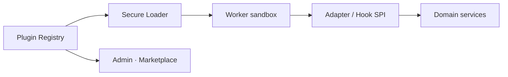

# OpsEdge360 — Plugin Framework

**Document ID:** OE360-PLG-P1-001  
**Phase:** 1

---

## 1. Goals

- Add capabilities **without modifying platform core**  
- Support cloud providers, monitors, security tools, ITSM, IdP, notifications, AI providers  
- Signed, versioned, tenant-installable packages  
- Customer UI remains OpsEdge360-branded  

---

## 2. Plugin kinds

| Kind | Examples |
|------|----------|
| `engine-adapter` | SkyWalking, Wazuh, GLPI, NetBox, n8n, Ansible |
| `cloud-provider` | AWS, Azure, GCP collectors/cost |
| `identity` | OIDC/SAML providers extras |
| `notification` | Slack, Teams, PagerDuty-class |
| `ai-provider` | Model endpoints / embeddings |
| `pack` | Banking360 dashboards, controls, skills |
| `widget` | Marketplace dashboard widgets |
| `report-template` | Executive/compliance templates |

---

## 3. Package shape (conceptual)

```text
plugin.zip
├── manifest.json      # id, kind, version, permissions, entitlements
├── signature.sig
├── openapi.fragment.json   # optional routes contribution
├── ui/                     # optional OpsEdge-themed widgets only
├── worker/                 # adapter or job handlers
└── README.md
```

`manifest.json` declares required secrets, scopes, and event subscriptions.

---

## 4. Runtime



- Plugins run out-of-process where possible  
- Granted least-privilege tokens  
- Health reported in Admin → Connectors / Marketplace  

---

## 5. Hooks

| Hook | When |
|------|------|
| `onInstall` / `onUninstall` | Lifecycle |
| `onConfigValidate` | Connector save |
| `mapToCanonical` | Ingest mapping |
| `contributeMenu` | Entitled nav items (OpsEdge IA only) |
| `contributeTools` | Copilot tools |
| `contributeReports` | Templates |

Forbidden: injecting third-party brand chrome; bypassing RBAC; cross-tenant access.

---

## 6. Marketplace flow

Discover → entitlement check → install → configure secrets → test → enable → audit  

Air-gap: signed offline bundle import.

---

## 7. Versioning & compatibility

- Semantic versioning  
- Declare `minPlatformVersion`  
- Core maintains adapter interface compatibility windows (`v1`, `v2`)  

---

## 8. Security

- Signature verification required in production  
- SBOM attestation for enterprise SKUs  
- Plugin permissions reviewed at install  
- Runtime network egress allowlists  
