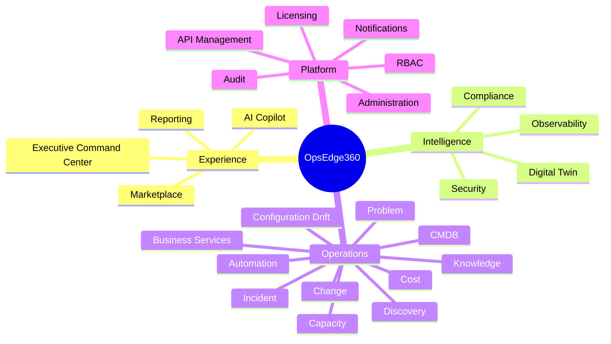

# OpsEdge360 — Product Module Architecture

**Document ID:** OE360-MOD-P1-001  
**Phase:** 1  
**Parent:** [OPSEDGE360_ENTERPRISE_ARCHITECTURE.md](./OPSEDGE360_ENTERPRISE_ARCHITECTURE.md)

Modules are **product capabilities**, not open-source products. Each module has owners, APIs, events, screens, and entitlements.

---

## Module map

---

## 1. Executive Command Center

| | |
|--|--|
| **Purpose** | Single pane for CIO/CTO/CISO posture, risk, and actions |
| **Inputs** | Aggregated dashboard API, twin health, incidents, security, compliance |
| **Outputs** | KPI cards, domain health, action queue, drill-downs |
| **Depends on** | Twin, Observability, Security, ITSM, Reporting |
| **Engine** | Native aggregation (gateway) |

---

## 2. AI Copilot

| | |
|--|--|
| **Purpose** | Natural language assistant for ops questions, RCA, runbooks |
| **Capabilities** | Chat, tool use, citations to live APIs/DB, disclaimers |
| **Gates** | Never auto-execute high-risk remediation without approval |
| **Engine** | Native AI plane + optional model providers via plugin |

---

## 3. Digital Twin *(flagship)*

| | |
|--|--|
| **Purpose** | Live graph of business ↔ tech dependencies with health/risk/impact |
| **Objects** | Services, apps, hosts, K8s, DBs, network, cloud, security controls |
| **Views** | Executive, operator, AI, blast radius, drift overlay |
| **Engine** | Native twin + CMDB; enriched by adapters |
| **Detail** | [OPSEDGE360_DIGITAL_TWIN_ARCHITECTURE.md](./OPSEDGE360_DIGITAL_TWIN_ARCHITECTURE.md) |

---

## 4. Observability

| | |
|--|--|
| **Purpose** | Metrics, logs, traces, profiling, topology, synthetic foundations |
| **UX** | Always OpsEdge chrome — never SkyWalking UI |
| **Engine** | SkyWalking / OTel adapter (primary); extensible |
| **Submodules** | Apps, Infra, Cloud, K8s, Containers, Logs, Metrics, Traces, Topology |

---

## 5. Security

| | |
|--|--|
| **Purpose** | Findings, posture, FIM, vuln, compliance signals, threat timeline |
| **UX** | Security Workspace (MITRE mapping, evidence, remediation links) |
| **Engine** | Wazuh adapter (primary) |
| **Integrates** | Incident, Twin, Automation |

---

## 6. CMDB

| | |
|--|--|
| **Purpose** | Authoritative CI registry and relationships |
| **Objects** | CIs, owners, environments, criticality, lifecycle |
| **Engine** | Native CMDB + optional GLPI/NetBox sync |

---

## 7. Discovery

| | |
|--|--|
| **Purpose** | Continuous / scheduled discovery of assets and dependencies |
| **Outputs** | Candidate CIs, relationship proposals, drift candidates |
| **Engine** | Native discovery + engine inventories (Wazuh syscollector, GLPI agents) |

---

## 8. Configuration Drift

| | |
|--|--|
| **Purpose** | Detect and visualize undesired config state vs baseline |
| **Views** | Twin overlay, CI detail, compliance linkage |
| **Engine** | Native rules + Ansible facts / SCA signals |

---

## 9. Business Services

| | |
|--|--|
| **Purpose** | Map tech to business outcomes and SLOs |
| **KPIs** | Availability, latency, error budget, revenue impact (pack-aware) |
| **Engine** | Native + transactions service |

---

## 10–12. Incident / Problem / Change Management

| Module | Purpose | Notes |
|--------|---------|-------|
| Incident | Detect → investigate → remediate → verify → close + report | Incident Workspace lifecycle (P1) |
| Problem | Recurring root causes, known errors | Linked to incidents |
| Change | Controlled change records, risk, CAB hooks | Integrate GLPI or native |

Always branded OpsEdge360; GLPI is optional backend via adapter.

---

## 13. Knowledge

| | |
|--|--|
| **Purpose** | Runbooks, KB articles, post-incident learnings |
| **Consumers** | Copilot, Incident Workspace, Automation |
| **Engine** | Native + optional ITSM sync |

---

## 14. Automation

| | |
|--|--|
| **Purpose** | Policy-gated runbooks, workflows, remediation |
| **Modes** | Dry-run, approve, execute, verify |
| **Engines** | n8n (workflows), Ansible (host changes) |
| **UX** | OpsEdge automation center — not n8n/Ansible UIs |

---

## 15. Compliance

| | |
|--|--|
| **Purpose** | Frameworks, controls, evidence, attestation |
| **Engine** | Native compliance engine; Wazuh SCA as signal source |

---

## 16. Capacity Planning

| | |
|--|--|
| **Purpose** | Forecast saturation, right-size recommendations |
| **Inputs** | Metrics adapter + twin topology |
| **AI** | Capacity assistant (see AI architecture) |

---

## 17. Cost Optimization

| | |
|--|--|
| **Purpose** | Cloud/infra waste, idle resources, pack-aware FinOps views |
| **Engine** | Native + cloud provider plugins |

---

## 18. Reporting

| | |
|--|--|
| **Purpose** | Executive, incident, automation, compliance, audit reports |
| **Formats** | PDF, XLSX, CSV, JSON (docx future) |
| **Engine** | Native reporting service |

---

## 19. Marketplace

| | |
|--|--|
| **Purpose** | Packs, plugins, connectors, dashboard templates |
| **Constraint** | Installs via signed packages; no third-party brand in UX |

---

## 20. Administration

| | |
|--|--|
| **Purpose** | Tenants, users, IdP, integrations, system health |
| **Includes** | Connector credentials for engines (admin-only) |

---

## 21. Licensing

| | |
|--|--|
| **Purpose** | SKUs, packs, seats, metering, air-gap license files |
| **Gates** | Module visibility and API quotas |

---

## 22. RBAC

| | |
|--|--|
| **Purpose** | Roles, permissions, SoD policies |
| **Applies to** | Every module and API |

---

## 23. Audit

| | |
|--|--|
| **Purpose** | Immutable activity for auth, config, automation, incidents |
| **Consumers** | Compliance, reports, forensics |

---

## 24. Notifications

| | |
|--|--|
| **Purpose** | Multi-channel alerting and lifecycle notifications |
| **Plugins** | Email, Slack, Teams, webhook, PagerDuty-class |

---

## 25. API Management

| | |
|--|--|
| **Purpose** | Public API keys, webhooks, rate limits, developer portal readiness |
| **Detail** | [OPSEDGE360_ENTERPRISE_APIS.md](./OPSEDGE360_ENTERPRISE_APIS.md) |

---

## Entitlement matrix (sketch)

| Module | Core | Enterprise | Pack-add |
|--------|------|------------|----------|
| Executive / Twin / Incident | ✓ | ✓ | |
| Observability depth | ✓ | ✓ | |
| Security Workspace | ✓ | ✓ | |
| Automation execute | | ✓ | |
| Vertical KPIs | | | ✓ |
| Marketplace premium | | ✓ | ✓ |

---

## Ownership model

Each module defines: **Product owner**, **Tech owner**, **Primary APIs**, **Primary events**, **Primary screens**, **Adapter dependencies**.
