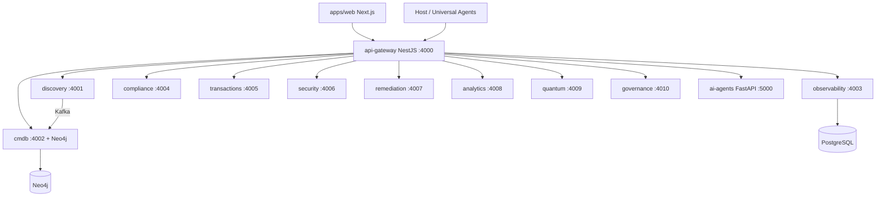

# OpsEdge360 — Current Platform Review

**Program:** Phase 1 Complete Platform Assessment (Master Enterprise Program)  
**Product:** OpsEdge360 — Enterprise Digital Operations Intelligence Platform  
**Company:** AsoftechInsightz  
**Assessment date:** 2026-07-12  
**Code baseline:** branch `release/v1.0.0-ga` @ `4222b45ac00f8081650465195eb21de84221a16e`  
**Production validation:** `P5_GA_VALIDATION_OK` (44/44) at same SHA  
**Release posture:** Phase 5 Waves 1–8 closed; Wave 9 GA validated in production; annotated tag `v1.0.0` pending formal closeout

> **Rule applied:** This document is assessment-only. No new platform features were implemented as part of this review.

---

## 1. Executive verdict

OpsEdge360 is a **production-deployed, multi-service enterprise operations platform** with strong foundations in:

- Tenant-aware API gateway + RBAC/ABAC  
- Discovery → CMDB → topology / digital twin  
- Observability / APM / telemetry plane  
- AIOps / LLM / knowledge graph / controlled remediation  
- Enterprise admin, HA/backup, integrations, certification, RC/GA packaging  

It is **not yet** a full peer to Datadog + Dynatrace + ServiceNow ITOM + Splunk + industrial OT suites in breadth. Competitive depth exists in **ops admin, governance, certification, and AI-assisted ops**; largest gaps are **synthetic monitoring (browser/global)**, **full ITSM suite**, **isolated Demo vs Production environments**, **industry solution packs beyond Banking360**, and **premium UX polish** (themes, DnD dashboards, a11y/i18n).

**Strategic position today:** Strong mid-market / enterprise pilot platform with GA packaging discipline. Next program phases should close Demo isolation and observability depth before broad industry expansion.

---

## 2. Architecture snapshot

| Layer | Implementation |
|-------|----------------|
| Frontend | Next.js 14 App Router, Tailwind, Recharts, Cytoscape (~90 routes) |
| API | NestJS BFF `/api/v1`, Swagger `/api/docs` |
| Services | 12 Express microservices + FastAPI AI agents |
| Data | PostgreSQL (migrations 001–041), Redis, Kafka, Neo4j, OpenSearch, MongoDB (compose) |
| Packages | 9 `@opsedge360/*` shared libraries |
| Deploy | Docker Compose (`core`/`full`/`prod`/`ha`), Helm `opsedge360` 1.0.0, nginx TLS |
| Agents | linux/windows/mac/docker/k8s + universal agent framework |

---

## 3. What is solid (preserve)

1. **AuthZ model** — JWT + permissions + ABAC + tenant spoof protection; `AUTHZ_ENFORCE` production default.  
2. **Additive migration discipline** — 40 SQL migrations through `041_wave9_ga.sql`; Wave validation gates.  
3. **Admin / automation / integrations** — Phase 5 Waves 1–5 depth is real and UI-wired.  
4. **Security plane** — secrets store, service identity / SPIFFE mTLS, dual-layer audit, security-observability.  
5. **Certification / RC / GA** — Wave 7–9 control planes and production validation scripts.  
6. **Discovery connector breadth** — k8s, AWS, Azure, GCP, SNMP, OPC-UA, Modbus, MQTT, VMware, Docker, DB, etc.  
7. **AI stack** — LLM gateway, correlation, predictive, KG, copilot, agents (bounded / approval-aware).

---

## 4. What is fragile or incomplete

| Area | Observation |
|------|-------------|
| Demo vs Production | RC demo seed exists; **no** dedicated demo DB/tenant isolation / demo banner / destructive-action kill-switch |
| Synthetic monitoring | Prometheus scrape “synthetic fallback” only — **not** enterprise HTTP/browser synthetics |
| Helm | Gateway/web plane ready; not full parity with every Compose microservice |
| Experimental services | `scheduler` (4011), `config-management` (4012) not in prod compose |
| Cloud secrets providers | Stubbed in shared-security |
| UX | Dark-only; design-system docs ahead of code; admin nav is flat chip strip |
| Tests | Solid unit/security tests; **no** Playwright/Cypress browser e2e |
| Industry packs | Banking360 deep; other verticals thin / transactional templates only |

---

## 5. Production reality

| Item | Status |
|------|--------|
| Live URLs | `observability360.asoftechinsightz.com` / `api.observability360…` |
| Deploy path | Git bundle → `scripts/vps-deploy-latest.sh` |
| Last GA validation | `P5_GA_VALIDATION_OK` pass=44 fail=0 |
| Known limitations | Full-scale load/soak gated; destructive chaos gated; K8s needs cluster-admin outside Compose path |

---

## 6. Recommendation for next program phases

1. **Freeze feature fantasy** — prioritize Demo/Production isolation (Phase 2 of master prompt) before new product modules.  
2. **Reuse** existing automation, integrations, compliance, observability, and admin shells.  
3. **Do not rewrite** gateway AuthZ, CMDB twin, or Wave 6–9 control planes.  
4. Implementation order: assessment sign-off → Demo env → Synthetic monitoring foundation → ITSM depth → Industry packs → UX premium pass.

---

## 7. Related artifacts

| Report | Path |
|--------|------|
| Feature inventory | [FEATURE_INVENTORY.md](./FEATURE_INVENTORY.md) |
| Gap analysis | [FEATURE_GAP_ANALYSIS.md](./FEATURE_GAP_ANALYSIS.md) |
| Technical debt | [TECHNICAL_DEBT.md](./TECHNICAL_DEBT.md) |
| UI/UX | [UI_UX_REVIEW.md](./UI_UX_REVIEW.md) |
| Security | [SECURITY_REVIEW.md](./SECURITY_REVIEW.md) |
| Database | [DATABASE_REVIEW.md](./DATABASE_REVIEW.md) |
| API | [API_REVIEW.md](./API_REVIEW.md) |
| Performance | [PERFORMANCE_REVIEW.md](./PERFORMANCE_REVIEW.md) |
| Roadmap | [IMPLEMENTATION_ROADMAP.md](./IMPLEMENTATION_ROADMAP.md) |

Legacy reviews under `docs/*_REVIEW.md` remain historical; **this folder is the master-program Phase 1 source of truth**.
