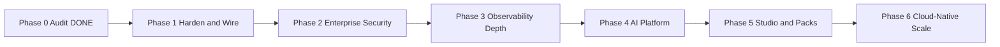

# OpsEdge360 — Phase 0 Enterprise Audit Report

**Document ID:** OE360-AUDIT-2026-07-10  
**Classification:** Internal — Architecture / Product / Security  
**Status:** COMPLETE — Development gated until roadmap approval  
**Branch audited:** `feature/sprint0-enterprise-foundation` (includes Phase 0 + Sprint 0 foundation)  
**Production:** LIVE and LOCKED at `https://observability360.asoftechinsightz.com`  
**Audit mode:** Read-only — no code was modified during this audit  

**Roles applied:** Enterprise Chief Architect · Product Architect · Solution Architect · Security Architect · AI Architect · DevOps Architect · Database Architect · UX Architect · Senior Full-Stack Engineer  

---

## 1. Executive Summary

OpsEdge360 is a **working, production-deployed** AIOps / observability platform with a NestJS API gateway, six core microservices in production Docker Compose, a Next.js console, PostgreSQL (`trinetra360`), Redis, Kafka, JWT/SSO auth, CMDB, discovery, OTLP/APM, Banking360 compliance, and a live VPS deployment.

**Sprint 0** added substantial foundation code (agent framework, discovery v2 connectors, shared-security, plugin SDK, scheduler, config-management, migration 015, topology, telemetry pipeline). Much of that foundation is **not yet wired** into the API gateway or production compose.

**Verdict:** The platform is a **strong Phase-1/GA core** with **enterprise ambition ahead of enterprise enforcement**. Vision coverage is broad; production surface, security enforcement, AI depth, Dashboard Studio, and Kubernetes readiness lag the product vision.

| Dimension | Score (0–100) | One-line |
|-----------|---------------|----------|
| Overall maturity | **58** | Production-capable core; incomplete enterprise layer |
| Production readiness | **68** | VPS live; 6/12+ services; weak self-monitoring |
| Security maturity | **42** | Auth present; RBAC/ABAC library unused at gateway |
| AI readiness | **28** | Rule-based stubs; no production LLM/RAG |
| Frontend maturity | **52** | Broad console; no studio/builders; desktop-only shell |
| DevOps / K8s | **35** | Compose works; Helm has no templates; no CD |
| Documentation | **78** | Extensive BRD/FRS/NFR/architecture; no titled PRD/TRD |

**Gate:** Do not begin net-new feature development until this audit is reviewed and a phased roadmap is approved. Production remains LOCKED (domains, DB name, volumes, SSL, Nginx, migrations 001–014).

---

## 2. Current Maturity Score (0–100)

### Weighted model

| Domain | Weight | Score | Weighted |
|--------|--------|-------|----------|
| Architecture & modularity | 12% | 72 | 8.6 |
| Backend / API completeness | 15% | 65 | 9.8 |
| Frontend / UX | 10% | 52 | 5.2 |
| Database design | 10% | 70 | 7.0 |
| Security & zero trust | 15% | 42 | 6.3 |
| Observability (product) | 10% | 75 | 7.5 |
| Observability (platform SRE) | 5% | 30 | 1.5 |
| AI / Agentic | 8% | 28 | 2.2 |
| DevOps / CI/CD / K8s | 8% | 35 | 2.8 |
| Documentation & governance | 7% | 78 | 5.5 |
| **TOTAL** | **100%** | | **58 / 100** |

### Maturity band

| Band | Range | OpsEdge360 |
|------|-------|------------|
| Prototype | 0–30 | |
| MVP / Early GA | 31–50 | |
| **Production GA (core)** | **51–70** | **← Current (58)** |
| Enterprise-ready | 71–85 | Target after Phases 1–3 |
| Market-leading | 86–100 | Long-term |

---

## 3. Strengths

1. **Live production** — Domains, Nginx TLS, Compose prod stack, login verified historically.
2. **Clear modular monorepo** — `apps/`, `services/`, `packages/`, `agents/`, `database/`, `docs/`.
3. **API-first gateway** — NestJS `/api/v1` with Swagger, JWT guard, tenant header propagation.
4. **Domain breadth** — Discovery, CMDB, twin/blast radius, OTLP/APM, Prometheus, transactions, security, compliance, Banking360.
5. **Event-driven path** — KafkaJS event-bus with soft-fail and HTTP ingest fallback.
6. **Multi-tenancy baseline** — `tenants` table + `resolveTenantId` + `X-Tenant-ID`.
7. **Auth surface** — Login, signup, forgot/reset password, OIDC/SAML SSO admin.
8. **Sprint 0 foundation code** — Agent framework, 17 discovery protocols, migration 015 schema, plugin SDK, shared-logger/security.
9. **Documentation depth** — Vision, BRD, FRS, NFR, C4/architecture set, governance policies, Sprint 0 pack, VPS deploy guide.
10. **Production locks documented** — Domain, DB name `trinetra360`, volumes, Nginx, migration freeze rules.

---

## 4. Weaknesses

1. **Sprint 0 unwired** — Scheduler, config-management, shared-security, topology/pipeline/agent-config APIs not on gateway and/or not in `docker-compose.prod.yml`.
2. **RBAC/ABAC not enforced** — Library + tables exist; gateway does not call them.
3. **4+ microservices orphaned from prod** — remediation, analytics, quantum, governance (gateway still proxies → runtime failures if called).
4. **AI is stubbed** — FastAPI agents return templates; LangGraph placeholder; no LLM provider.
5. **No Dashboard Studio / Report / KPI Builder** — Vision features absent from UI.
6. **Helm chart non-installable** — `values.yaml` without `templates/`.
7. **CI without CD** — Build/scan only; Trivy `exit-code: 0` (non-blocking).
8. **Platform self-monitoring weak** — Prometheus/Grafana not in prod; gateway health is hardcoded “up”.
9. **Frontend shell not mobile** — Fixed 240px sidebar; password-reset routes missing from middleware public list.
10. **Docs vs reality drift** — K8s/Vault guides describe systems not present on VPS.

---

## 5. Technical Debt

| ID | Debt | Severity | Location |
|----|------|----------|----------|
| TD-01 | Dual audit tables (`audit_log` vs `audit_logs`) | Medium | migrations 001 / 015 |
| TD-02 | JWT `users.role` string vs Sprint 0 `roles`/`user_roles` | High | auth + shared-security |
| TD-03 | Discovery connectors partially mock (AWS/static demo) | High | `services/discovery/connectors` |
| TD-04 | Gateway health returns static service map | High | `health.controller.ts` |
| TD-05 | OpenAPI static YAML incomplete vs Nest controllers | Medium | `openapi/trinetra360-v1.yaml` |
| TD-06 | Page-monolith frontend; 7 shared components only | Medium | `apps/web` |
| TD-07 | Dual API clients without shared cache (React Query) | Low | `api.ts` / `api-client.ts` |
| TD-08 | JWT cookie not HttpOnly | High | `apps/web/src/lib/auth.ts` |
| TD-09 | Redis/Kafka unauthenticated in Compose | High | `docker-compose.yml` |
| TD-10 | Postgres/Redis/Kafka ports published on host in base compose | High | prod overlay inherits |
| TD-11 | Helm/Terraform scaffolds incomplete | Medium | `infra/` |
| TD-12 | RPO/RTO contradictions across docs (15m vs 24h) | Medium | BACKUP vs NFR vs ops manual |
| TD-13 | Legacy naming (`trinetra360`, Helm path) intentional but confusing | Low | locked |
| TD-14 | Agent Approve/Reject UI buttons unwired | Low | `apps/web` agents page |
| TD-15 | SLA chart hardcoded demo data | Low | `SlaChart.tsx` |
| TD-16 | `console.log` still used in older services (Sprint 0 packages use structured logger) | Medium | discovery/cmdb/observability legacy |
| TD-17 | No circuit breaker on gateway Axios proxy | Medium | `proxy.service.ts` |
| TD-18 | Migrate container mounts full repo + runtime `npm install pg` | Medium | `docker-compose.prod.yml` |

---

## 6. Security Risks

| ID | Risk | OWASP | Severity | Evidence |
|----|------|-------|----------|----------|
| SEC-01 | RBAC/ABAC not enforced on APIs | A01 | **Critical** | Zero imports of `@opsedge360/shared-security` in gateway |
| SEC-02 | Tenant isolation trusts `X-Tenant-ID` / JWT slug without RLS | A01 | **High** | No Postgres RLS |
| SEC-03 | JWT in non-HttpOnly cookie (XSS → token theft) | A07 | **High** | `oe360_token` readable by JS |
| SEC-04 | No MFA | A07 | **High** | NFR requires; not implemented |
| SEC-05 | No Vault/KMS — secrets in `.env` only | A02 | **High** | NFR-SEC-05 unmet |
| SEC-06 | Redis without AUTH; Kafka PLAINTEXT | A02 | **High** | compose |
| SEC-07 | Auth rate limit in-memory only | A04 | Medium | resets on restart |
| SEC-08 | No WAF / edge rate limit | A05 | Medium | Nginx has no limit_req |
| SEC-09 | Trivy non-blocking in CI | A06 | Medium | `exit-code: '0'` |
| SEC-10 | No mTLS between services | A05 | Medium | HTTP internal |
| SEC-11 | SIEM/fraud engines heuristic, not SOC-grade | — | Low–Med | security service |
| SEC-12 | Grafana `admin` default in full profile | A05 | Medium | local full stack |
| SEC-13 | API keys table unused for HTTP auth | A07 | Medium | migration 015 |
| SEC-14 | Password reset routes may be blocked by middleware | A07 | Medium | web middleware public list |

**Security maturity (self-assessed this audit):** **42/100** (prior internal review cited ~4.5/10 ≈ 45).

---

## 7. Performance Risks

| ID | Risk | Impact |
|----|------|--------|
| PERF-01 | OTLP/logs persisted to Postgres — will not scale to high ingest | Storage & query latency |
| PERF-02 | Topology refresh loads up to 500 CIs + relationships in one shot | Memory / latency |
| PERF-03 | No Redis caching on hot CMDB/executive paths in all services | DB load |
| PERF-04 | Gateway proxy timeout 5s default — long discovery scans fail | UX / 504s |
| PERF-05 | Network discovery TCP scan can be expensive if misconfigured | CPU / network |
| PERF-06 | Frontend SSR `revalidate: 30` without client cache for interactive pages | Duplicate fetches |
| PERF-07 | No connection pool tuning visibility in prod metrics | Blind spots |
| PERF-08 | Kafka soft-fail → HTTP fallback may overload CMDB | Thundering herd |

---

## 8. Scalability Risks

| ID | Risk | Notes |
|----|------|-------|
| SCALE-01 | Single-node VPS Compose — no HA for Postgres | Active-passive via restore only |
| SCALE-02 | Helm/K8s not deployable | Cannot horizontal-scale via claimed path |
| SCALE-03 | Scheduler not distributed (single process interval) | Not in prod anyway |
| SCALE-04 | In-memory rate limits / OTLP counters | Not multi-instance safe |
| SCALE-05 | No OpenSearch as primary log store in prod | Postgres log path |
| SCALE-06 | Agent offline queue client-side only | Limited durability |
| SCALE-07 | Industry packs partially hardcoded (Banking360) | Not fully metadata-driven |

---

## 9. Missing Enterprise Features (vs Frozen Vision)

| Vision capability | Status |
|-------------------|--------|
| Infrastructure / APM / Logs / Traces | **Partial–Strong** (prod) |
| Network / DB / Cloud / K8s monitoring | **Partial** |
| OT monitoring | **Partial** (zones UI; connectors exist) |
| DEM / RUM | **Missing** |
| Business transaction monitoring | **Present** |
| AIOps / Agentic AI / Copilot | **Stub / rule-based** |
| RCA / Predictive / Auto-remediation | **Partial stubs** (remediation not in prod) |
| Incident / Change management | **Schema partial; UI thin** |
| CMDB / Discovery | **Strong core** |
| Workflow automation | **Missing** (scheduler foundation only) |
| Security observability | **Partial** |
| Compliance / Risk | **Partial** (Banking360 strong) |
| Quantum Shield | **Stub service; not in prod** |
| Dashboard Studio | **Missing** |
| Report / KPI Builder | **Missing** |
| Integration Marketplace | **Missing** (plugin SDK foundation only) |
| Webhooks | **Missing / minimal** |
| White label | **Missing** |
| Multi-tenant SaaS | **Baseline** (not enterprise-hardened) |
| RBAC + Audit logging | **Schema yes; enforcement no** |
| Industry packs (15 industries) | **Banking deep; others display/seed** |
| Country compliance packs | **Partial frameworks; not full country packs** |

---

## 10. UI/UX Gaps

1. No Dashboard Studio (drag-drop, widgets, scheduled reports, PDF/Excel).
2. No Report Builder / KPI Builder.
3. Desktop-only shell (fixed sidebar; no mobile nav).
4. Header search and notification bell are non-functional stubs.
5. Agents Approve/Reject buttons have no handlers.
6. Executive SLA chart uses hardcoded data.
7. KPI “vs yesterday” deltas are decorative.
8. No light theme / tenant white-label tokens.
9. Inter/JetBrains fonts configured but not loaded via `next/font`.
10. Weak shared component library (forms, tables, toasts, empty states).
11. Forgot/reset password may be blocked by middleware when auth required.
12. No role-based navigation hiding.
13. Industry pack UX beyond Banking360 is read-only cards.
14. No dedicated settings hub (SSO only under settings).

---

## 11. Database Issues

| Issue | Detail |
|-------|--------|
| Dual audit models | `audit_log` (001) and `audit_logs` (015) |
| Role model split | `users.role` vs `roles` / `user_roles` |
| No RLS | Tenant isolation application-only |
| Log/metric growth | OTLP tables without partitioning in prod path |
| Naming legacy | DB `trinetra360` locked — acceptable but document clearly |
| Index coverage | Generally good on tenant_id; audit/job_runs need time partitioning later |
| Migration 002 gap | Numbering jumps 001 → 003 (historical) |
| Seeds vs prod | Demo seeds must never run against production without guard |
| Sprint 0 tables | Present in 015; unused until services wired |
| Relationship table naming | Confirm `relationships` vs `ci_relationships` consistency across connectors |

---

## 12. API Issues

| Issue | Detail |
|-------|--------|
| Docs vs gateway | Sprint 0 docs list `/scheduler/*`, `/config-management/*`, agent config, topology, pipeline — **not proxied** |
| Orphan proxies | Gateway proxies remediation/analytics/quantum/governance — **not in prod compose** |
| OpenAPI drift | Static YAML incomplete; Swagger tags incomplete in `main.ts` |
| Error standards | Inconsistent `{ error }` vs structured error codes |
| Pagination | Not uniformly applied across list endpoints |
| Versioning | `/api/v1` only — no deprecation policy enforced |
| Health | Gateway health not dependency-aware |
| Rate limiting | Not global |
| Idempotency | Not standard on mutating APIs |
| Webhooks | Not a first-class API surface |

---

## 13. AI Readiness

| Capability | Score | Notes |
|------------|-------|-------|
| Agent orchestration skeleton | 40 | FastAPI + named agents |
| LLM integration | 10 | No provider SDK; placeholder reason() |
| Prompt management | 5 | No prompt registry/versioning |
| RAG | 5 | No vector store / embeddings pipeline |
| Copilot UI | 45 | Panel exists; backend rule/keyword |
| RCA | 25 | Template responses |
| Predictive analytics | 30 | Service exists; not in prod |
| Auto-remediation | 25 | Simulated; not in prod |
| Edge agents (host metrics) | 70 | Real metrics path |
| Plugin extensibility for AI | 40 | plugin-sdk foundation |

**AI readiness overall: 28/100** — architecture hooks exist; intelligence layer is not production AI.

---

## 14. Compliance Readiness

| Area | Status |
|------|--------|
| Framework engine | Present (compliance service) |
| Banking360 / payments controls | Strongest pack |
| Industry packs metadata | Partial (`industry_packs` table) |
| Country packs (IN/US/UK/EU/…) | **Not fully implemented** as configurable packs |
| Evidence collection | Partial schema |
| Audit logging (enforced) | **Weak** — writeAuditLog unused at gateway |
| FedRAMP / HA-DR UI | Present; service not in prod |
| Data residency controls | Not evidenced |
| DPDP / GDPR workflows | Docs aspirational |

**Compliance readiness: ~45/100** for BFSI demo; **~25/100** for multi-country enterprise packs.

---

## 15. Production Readiness

### What is production-ready today

- Web + API gateway + discovery + cmdb + observability + compliance + transactions + security  
- Nginx TLS on locked domains  
- Postgres `trinetra360`, Redis, Kafka (core)  
- JWT auth + SSO  
- Backup scripts (daily dump)  

### What is not production-ready

- Scheduler, config-management, remediation, analytics, quantum, governance, ai-agents  
- Helm/K8s  
- Vault/MFA/mTLS/WAF  
- Platform Prometheus/Grafana in prod  
- Sprint 0 API surface via public gateway  
- CD pipeline  

### Production lock (DO NOT CHANGE without change control)

| Locked | Value |
|--------|-------|
| Web domain | `observability360.asoftechinsightz.com` |
| API domain | `api.observability360.asoftechinsightz.com` |
| Database | `trinetra360` |
| Docker volumes | Existing names |
| SSL / Nginx routing | Existing |
| Migrations 001–014 | Immutable |
| Existing auth contracts | Backward compatible |

**Production readiness score: 68/100** for current GA core; **~40/100** against full vision.

---

## 16. Prioritized Backlog

### P0 — Stabilize & wire (before new features)

| ID | Item | Why |
|----|------|-----|
| P0-01 | Enforce RBAC at API gateway using `shared-security` | Critical security gap |
| P0-02 | Wire Sprint 0 routes: agent config, topology, pipeline | Docs/API mismatch |
| P0-03 | Add scheduler + config-management to prod compose **or** remove from public claims | Honesty / ops |
| P0-04 | Fix gateway health to probe real dependencies | SRE |
| P0-05 | Fix middleware public paths for forgot/reset password | Auth UX/security |
| P0-06 | HttpOnly + Secure cookie strategy (or BFF session) | XSS |
| P0-07 | Stop publishing DB/Redis/Kafka on public interfaces; Redis AUTH | Hardening |
| P0-08 | Make Trivy fail CI on CRITICAL | Supply chain |
| P0-09 | Align backup RPO/RTO docs; verify cron on VPS | DR |
| P0-10 | Unify audit_log vs audit_logs | Data integrity |

### P1 — Enterprise foundation completion

| ID | Item |
|----|------|
| P1-01 | Gateway proxy + Nest controllers for scheduler & config-management |
| P1-02 | API key authentication path |
| P1-03 | ABAC policy evaluation middleware |
| P1-04 | Structured logger adoption across legacy services |
| P1-05 | Circuit breaker + retry on proxy |
| P1-06 | OpenAPI 3.1 complete regeneration |
| P1-07 | Prod self-monitoring (Prometheus + Grafana or managed) |
| P1-08 | Mobile-responsive shell |
| P1-09 | Wire agent approval UI |
| P1-10 | Live SLA / KPI deltas from real data |

### P2 — Product vision expansion

| ID | Item |
|----|------|
| P2-01 | Dashboard Studio (drag-drop) |
| P2-02 | KPI Builder |
| P2-03 | Report Builder + PDF/Excel + schedule |
| P2-04 | LLM-backed Copilot + prompt registry |
| P2-05 | RAG over CMDB + logs + runbooks |
| P2-06 | Real cloud SDKs (AWS/Azure/GCP/K8s) |
| P2-07 | Metadata-driven industry + country packs |
| P2-08 | White-label theming |
| P2-09 | Webhooks + marketplace |
| P2-10 | Incident & change management UX |

### P3 — Scale & cloud-native

| ID | Item |
|----|------|
| P3-01 | Helm templates + locked-domain values-prod |
| P3-02 | CD to staging/prod |
| P3-03 | Vault/KMS |
| P3-04 | MFA |
| P3-05 | OpenSearch log backend |
| P3-06 | Postgres partitioning for telemetry/audit |
| P3-07 | Multi-region HA |
| P3-08 | DEM/RUM |
| P3-09 | WAF |
| P3-10 | Formal PRD/TRD documents |

---

## 17. Recommended Roadmap

> **FROZEN** — See authoritative documents:  
> - `docs/governance/FROZEN_ROADMAP.md`  
> - `docs/governance/FROZEN_PRODUCT_VISION.md`  
> - `docs/governance/FROZEN_ARCHITECTURE.md`  
> - `docs/governance/INDUSTRY_SOLUTION_PACKS.md` (Banking360 = optional pack)  
> - `docs/phase1/PHASE1_IMPLEMENTATION_PLAN.md`  

**Development gate:** No Phase 1 production code until Phase 1 plan + ADRs are approved.

---

## Repository Snapshot (Evidence)

| Area | Finding |
|------|---------|
| Structure | `apps/` (web, api-gateway), `services/` (12), `packages/` (9+), `agents/`, `ai-agents/`, `database/`, `infra/`, `docs/` |
| Prod compose services | migrate, discovery, cmdb, observability, compliance, transactions, security, api-gateway, web, nginx |
| Missing from prod | scheduler, config-management, remediation, analytics, quantum, governance, ai-agents |
| Migrations | 001, 003–015 (no 002) |
| Frontend routes | ~26 pages; 7 shared components |
| CI | lint/test/build, Trivy, SBOM, license — **no deploy** |
| Helm | Chart.yaml + values.yaml — **0 templates** |
| AI | Rule-based FastAPI stubs |
| Docs | BRD/FRS/NFR/vision present; **no file titled PRD/TRD** |

---

## Audit Completion Statement

Phase 0 Mandatory Enterprise Audit is **COMPLETE**.

- All 17 deliverables above are documented.  
- **No development** was started as part of this audit.  
- Next step: **stakeholder review and approval of the Recommended Roadmap (Section 17)**, then Phase 1 planning with task-level breakdown.

**Approval required to proceed to development:**

| Role | Name | Date | Sign-off |
|------|------|------|----------|
| Product Owner | | | ☐ |
| Chief Architect | | | ☐ |
| Security Architect | | | ☐ |
| DevOps / SRE Lead | | | ☐ |

---

*OpsEdge360 Powered by AsoftechInsightz — Phase 0 Audit — 2026-07-10*
