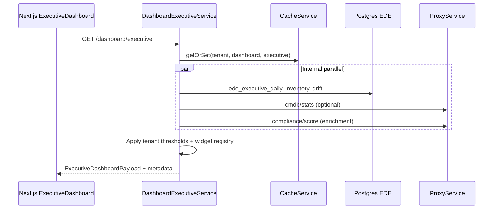

# OpsEdge360 — Backend Alignment with Enterprise Frontend (Phase 3.5)

**Status:** Architectural assessment & migration plan (no implementation)  
**Date:** 2026-07-13  
**Scope:** Align backend with Phase 1–3 frontend redesign without breaking existing APIs  
**Principle:** Frontend requests, displays, and acts — backend is the single source of truth

---

## Executive summary

OpsEdge360 already has a capable API gateway (`/api/v1`) with domain-oriented controllers, JWT/RBAC auth, partial caching, tenant settings, and commercial entitlements. The new Executive Dashboard, however, still fans out across **6–10 HTTP calls**, embeds **health thresholds and domain taxonomy in React**, and uses **hardcoded navigation** unrelated to tenant licenses.

Phase 3.5 should introduce an **additive** dashboard aggregation layer, **shared widget contracts** in `@opsedge360/shared-types`, and **centralized configuration** — while keeping every existing `/executive/*`, `/cmdb/*`, and domain route working unchanged.

**Recommended first move:** `GET /api/v1/dashboard/executive` (aggregator) composed from existing `ExecutiveController` logic, with optional envelope metadata — not a rewrite of microservices.

---

## 1. Backend architecture assessment

### 1.1 Current topology

```
Browser (Next.js)
    │
    ▼
API Gateway (NestJS)  ── prefix: /api/v1
    ├── Gateway-local handlers (Postgres: EDE, admin, auth, phase*)
    ├── ProxyService → microservices (CMDB, compliance, security, observability, AI, …)
    └── CacheService → Redis or in-memory (@opsedge360/cache)
```

| Layer | Location | Role |
|-------|----------|------|
| Gateway | `apps/api-gateway` | BFF, auth, tenant resolution, aggregation, demo/EDE |
| Shared DB | `@opsedge360/shared-db` | Postgres queries, tenant UUID resolution |
| Platform config | `packages/platform-config` | Deployment mode, cache TTL, env plane |
| Security | `packages/shared-security` | RBAC permissions, path inference, ABAC hooks |
| Cache | `packages/cache` | Tenant-scoped keys `t:{tenantId}:{namespace}:{key}` |
| Contracts | `packages/shared-types` | Minimal shared DTOs (only `ExecutiveKpis` used by web today) |

### 1.2 API organization today

APIs are **partially** domain-aligned but grew through release waves (`phase2`–`phase4`, `rc2`–`rc3`, `wave6`–`wave9`):

| Domain (target) | Current routes | Maturity |
|-----------------|----------------|----------|
| **Dashboard** | `/executive/*`, `/dashboards/*` (ops widget builder) | Executive split across 6 endpoints; no aggregator |
| **Estate** | `/discovery/*`, `/cmdb/*`, `/twin/*`, `/topology` (via cmdb) | Strong; Postgres fallbacks in gateway |
| **Observe** | `/observability/*`, `/apm`, `/synthetics`, `/network`, `/transactions` | Proxy-heavy; inconsistent shapes |
| **Assure** | `/security/*`, `/security-observability/*`, `/compliance/*`, `/itsm`, `/banking360` | Multiple security surfaces; compliance is generic proxy |
| **AI** | `/ai/*`, `/copilot/*`, `/ops-intelligence/*`, `/agents/*` | Overlapping RCA/recommendation paths |
| **Reports** | `/reports/*` | Gateway-local |
| **Admin** | `/admin/*`, `/platform/*`, `/commercial/*` | Settings, flags, entitlements exist |
| **Demo** | `/demo/ede/*` | Mature; critical for evaluators |

**Assessment:** Domain separation exists at the **controller** level but not as formal internal services. That is acceptable for Phase 3.5 — formalize boundaries in documentation and aggregator modules first; extract microservices later only where scale demands it.

### 1.3 Executive / dashboard APIs (current)

`apps/api-gateway/src/executive.controller.ts`:

| Endpoint | Returns | Cached |
|----------|---------|--------|
| `GET /executive/kpis` | `ExecutiveKpis` + illustrative metadata | Yes (`executive:kpis`) |
| `GET /executive/services` | Business service health array | No |
| `GET /executive/risks` | Top risks from drift | No |
| `GET /executive/trends` | `{ series: [...] }` (30-day) | No |
| `GET /executive/narrative` | what/why/impact/owner/next | No |
| `GET /executive/recommendations` | `{ items: [...] }` | No |

Separate product surface: `GET /dashboards/*` → observability service (custom ops dashboards). **Do not conflate** with executive home.

### 1.4 Caching

| What | TTL source | Notes |
|------|------------|-------|
| `executive/kpis` only | `platform-config.cacheTtlSec` (30–120s) | Other executive slices hit DB/proxy every request |
| CMDB blast-radius | Service-side DB table | Not gateway `CacheService` |

**Gap:** No coherent cache key for a full board pack; no `generatedAt` / `cacheHit` in responses.

### 1.5 Configuration & feature flags (existing)

| API | Auth | Purpose |
|-----|------|---------|
| `GET /platform/config` | Public | Deployment topology, cache settings |
| `GET /platform/environment` | Public | Env plane banner |
| `GET /platform/feature-flags` | Admin | Global `feature_flags` table |
| `PATCH /platform/feature-flags/:key` | Workflow permission | Upsert flag |
| `GET /commercial/entitlements` | Authenticated | License + subscription features |
| `GET|PATCH /me/preferences` | User | Theme, landing path |
| `GET|PUT /admin/settings` | Admin | Tenant/org settings |

**Gap:** Entitlements and feature flags are **not consumed** by frontend navigation. Banking360 visibility uses `NEXT_PUBLIC_PACK_BANKING360_ENABLED` only.

### 1.6 Auth & authorization

- **AuthN:** JWT Bearer (`AuthGuard`); `@Public()` for health/platform banner
- **AuthZ:** `AuthorizationGuard` — tenant UUID resolution, `inferPermission(method, path)` → `{segment}:{read|write|delete}`
- **Executive routes:** No explicit `@RequirePermission`; inferred as `executive:read`
- **Dashboard view elsewhere:** `PermissionIds.DASHBOARD_VIEW` = `platform:read` (naming mismatch)

Frontend currently parses JWT for user label and does **not** gate nav by permissions.

### 1.7 Response standards

**No unified enterprise envelope.** Patterns in use:

- Raw JSON payloads (`ExecutiveKpis`, arrays)
- Ad-hoc wrappers (`{ series }`, `{ items }`, `{ flags }`)
- Proxy pass-through from microservices
- Auth errors: `{ statusCode, code, message, permission? }`

### 1.8 AI layer fragmentation

| Prefix | Capabilities |
|--------|--------------|
| `/copilot` | chat, rca, recommendations (gateway `CopilotService`) |
| `/ai` | Proxy to observability LLM (chat, RAG, RCA, graph) |
| `/ops-intelligence` | correlate, incidents, forecasts |
| `/executive/narrative` + `/executive/recommendations` | Rule-based + EDE data (not LLM) |

**Assessment:** Executive AI insights should flow through a **unified AI facade** internally, even if external routes remain for backward compatibility.

---

## 2. Gap analysis — frontend vs backend

### 2.1 Executive Dashboard call pattern

`ExecutiveDashboard.tsx` (server) + `ExecutiveHomeApex.tsx` + `SlaChart.tsx` (client):

| Issue | Detail |
|-------|--------|
| **Call fan-out** | 6 parallel server calls + 2–3 client duplicates (`kpis`, `trends` fetched twice) |
| **Cross-domain leak** | `/cmdb/stats` pulled into dashboard for domain cards |
| **Business logic in UI** | `healthFromAvailability`, `domainHealth`, `postureStatus`, CMDB type string matching, `atRisk = totalAssets * 0.04` |
| **Fallback content** | Hardcoded recommendations when API empty |
| **Local types** | `Service`, `Risk`, `RecItem`, `TrendPoint` not in `shared-types` |
| **Threshold config** | Availability 99.9/99.5, MTTR 35/55m — hardcoded in React |

### 2.2 Navigation & licensing

| Issue | Detail |
|-------|--------|
| **Hardcoded nav** | `nav-config.ts` — no backend-driven menu |
| **License mismatch** | `/commercial/entitlements` exists but nav ignores it |
| **Feature flags** | Build-time env vars + localStorage debug; not tenant-aware |
| **Permissions** | Frontend never hides routes by RBAC |

### 2.3 Widget contract gap

Frontend `MetricCard` / `DomainCard` expect:

```
title, score/value, trend, status, sparkline?, drilldown href
```

Backend returns **inconsistent shapes** — bare arrays vs nested objects, no `status` enum, no `sparkline` series per widget, no widget `metadata`.

### 2.4 Configuration gap

| Config area | Today | Should be |
|-------------|-------|-----------|
| SLA thresholds | Hardcoded in UI + demo SQL | Tenant `admin/settings` or `platform_config` |
| Compliance frameworks | Generic `/compliance/*` | Framework as filter config, not separate APIs |
| Dashboard layout | N/A | Role-driven widget registry (future) |
| Branding | Partial RC2 routes | Tenant branding API consumed by shell |

### 2.5 Performance vs goals

| Goal | Current estimate | Blocker |
|------|------------------|---------|
| Dashboard load <2s | ~6–10 round trips + hydration duplicates | No aggregator; partial cache |
| Widget refresh <500ms | Uncached slices | Per-slice cache or SSE |
| Search <300ms | Command palette is client-side route index | No unified search API yet |
| Navigation instant | OK (static) | Will need cached `/platform/navigation` |

---

## 3. Refactoring plan — zero breaking changes

### 3.1 Non-negotiable rules

1. **All existing routes remain** — `/executive/kpis`, `/executive/services`, etc. unchanged
2. **Additive only** — new routes under `/dashboard/*`, `/platform/navigation`, envelope wrappers optional
3. **Proxy contracts preserved** — microservice paths untouched
4. **Gradual frontend migration** — feature flag `dashboard_aggregator_v1` switches UI to single fetch
5. **Shared-types versioning** — new interfaces are additive exports

### 3.2 Target API namespaces (domain-aligned)

Proposed **additive** gateway structure (internal modules, external paths):

```
/api/v1/dashboard/executive      ← NEW aggregator
/api/v1/dashboard/widgets/:id    ← Future per-widget refresh
/api/v1/estate/...               ← Alias/wrapper optional later (cmdb, discovery, twin)
/api/v1/observe/...              ← Future grouping
/api/v1/assure/...               ← Future grouping
/api/v1/platform/navigation      ← NEW nav config
/api/v1/platform/tenant-config   ← NEW tenant branding + licensed modules
/api/v1/executive/*              ← KEEP (deprecated-in-docs only, not removed)
```

**Do not rename** `/executive` → `/dashboard` for existing consumers. `/dashboard/executive` is the **composed** view.

### 3.3 Phased migration map

| Phase | Backend | Frontend | Breaking? |
|-------|---------|----------|-----------|
| **3.5a** | `GET /dashboard/executive` aggregator + shared widget types | Optional switch behind flag | No |
| **3.5b** | `GET /platform/navigation` + entitlements merge | Replace `nav-config.ts` consumption | No — fallback to static nav |
| **3.5c** | Standard response envelope (opt-in via `?envelope=1` or `Accept` header) | Adopt envelope in new code only | No |
| **3.5d** | Role dashboard config (`dashboard_layouts` table) | Compose widgets by role | No |
| **3.5e** | SSE/WebSocket channel for widget refresh | `useWidgetStream` hook | No — polling remains default |
| **4.x** | Domain alias routes | Tier-A page restyle | No |

---

## 4. Dashboard aggregation design

### 4.1 Aggregator responsibility

New module: `apps/api-gateway/src/dashboard/dashboard-executive.service.ts`

**Composes existing logic** — extract private methods from `ExecutiveController` or inject a shared `ExecutiveDataService`:

```
GET /api/v1/dashboard/executive
```

### 4.2 Response shape (proposed)

```typescript
// packages/shared-types — additive exports

export interface ApiEnvelope<T> {
  success: boolean;
  timestamp: string;       // ISO-8601
  requestId: string;       // x-request-id
  data: T;
  metadata?: ResponseMetadata;
  errors?: ApiError[];
}

export interface ResponseMetadata {
  generatedAt: string;
  cacheHit?: boolean;
  cacheTtlSec?: number;
  dataMode: 'live' | 'illustrative' | 'partial';
  label?: string;
  coverageLabel?: string;
  refreshIntervalSec?: number;
  role?: string;
}

export interface ExecutiveDashboardPayload {
  narrative: ExecutiveNarrative;
  health: HealthWidget[];
  operationalSummary: DomainWidget[];
  insights: {
    topRisks: RiskWidget[];
    affectedServices: ServiceHealthWidget[];
    aiRecommendations: RecommendationWidget[];
    recentIncidents?: IncidentWidget[];
  };
  recommendedActions: ActionWidget[];
  trends: TrendSeries;
}

export interface WidgetBase {
  id: string;
  title: string;
  description?: string;
  category: 'health' | 'estate' | 'observe' | 'assure' | 'ai' | 'action';
  status: 'healthy' | 'degraded' | 'critical' | 'unknown';
  drilldown?: { href: string; label: string };
  metadata?: WidgetMetadata;
}

export interface WidgetMetadata {
  permission?: string;
  refreshIntervalSec?: number;
  size?: 'sm' | 'md' | 'lg' | 'xl';
  roles?: string[];
  position?: number;
}

export interface HealthWidget extends WidgetBase {
  score: number | string;
  unit?: string;
  trend?: string;
  sparkline?: number[];
}

export interface DomainWidget extends WidgetBase {
  summary: string;
  count?: number;
  countLabel?: string;
}

export interface RiskWidget {
  id: string;
  title: string;
  severity: string;
  affectedService: string;
  revenueAtRisk?: number;
  owner?: string;
  recommendedAction?: string;
  drilldown: { href: string };
}

export interface ActionWidget {
  title: string;
  description: string;
  href: string;
  cta: string;
}
```

### 4.3 Aggregation flow



### 4.4 Caching strategy for aggregator

| Key | Namespace | TTL | Invalidation |
|-----|-----------|-----|--------------|
| Full board | `dashboard:executive` | `cacheTtlSec` (60s default) | EDE load/reset, drift resolve |
| Per-widget | `dashboard:widget:{id}` | 30s | Future SSE push |

Keep **existing** `executive:kpis` cache; aggregator may call internal service methods directly (no HTTP loopback).

### 4.5 Business rules relocation

Move from `ExecutiveDashboard.tsx` to gateway `DashboardRulesService`:

| Rule | Config source |
|------|---------------|
| Availability healthy ≥99.9%, degraded ≥99.5% | `tenant_settings.sla_thresholds` (default in platform-config) |
| MTTR healthy ≤35m, degraded ≤55m | Same |
| Security posture mapping | `security_posture_labels` config |
| Domain taxonomy (Infrastructure → Compliance) | `dashboard_domain_registry` static JSON in gateway v1, DB v2 |
| `atRisk` calculation | CMDB `atRiskAssets` from `/cmdb/stats` — no 4% heuristic |

---

## 5. Standard API contracts

### 5.1 Enterprise response envelope (opt-in)

**Phase 1:** New routes return envelope by default.  
**Phase 2:** Legacy routes accept `?envelope=1` or header `X-OpsEdge-Envelope: 1`.

```json
{
  "success": true,
  "timestamp": "2026-07-13T10:30:00.000Z",
  "requestId": "req_abc123",
  "data": { },
  "metadata": {
    "generatedAt": "2026-07-13T10:29:59.500Z",
    "cacheHit": false,
    "dataMode": "illustrative",
    "label": "Illustrative Demo Data"
  },
  "pagination": null,
  "errors": null
}
```

### 5.2 Pagination (list endpoints)

```json
{
  "data": { "items": [] },
  "pagination": {
    "page": 1,
    "pageSize": 50,
    "total": 200,
    "hasMore": true
  }
}
```

### 5.3 Error contract

```json
{
  "success": false,
  "timestamp": "...",
  "requestId": "...",
  "data": null,
  "errors": [
    { "code": "CMDB_UNAVAILABLE", "message": "...", "field": null, "retryable": true }
  ]
}
```

Align with existing `SecurityExceptionFilter` — wrap, don't replace.

### 5.4 Widget contracts (canonical)

| Widget type | Required fields | Optional |
|-------------|-----------------|----------|
| **Health** | `title`, `score`, `status` | `trend`, `sparkline`, `drilldown`, `unit` |
| **Security** | `critical`, `warning`, `healthy`, `status` | `trend`, `action` |
| **Network** | `availability`, `status` | `latency`, `packetLoss`, `bandwidth` |
| **Domain** | `title`, `summary`, `status` | `count`, `countLabel` |
| **Action** | `title`, `description`, `href`, `cta` | `permission` |

All widgets extend `WidgetBase` + `WidgetMetadata` for future configurable dashboards.

---

## 6. Configuration model

### 6.1 Configuration layers

```
┌─────────────────────────────────────────────┐
│ Platform (env / platform-config package)     │  deployment, cache TTL, Kafka
├─────────────────────────────────────────────┤
│ Global feature_flags (tenant_id IS NULL)   │  product-wide toggles
├─────────────────────────────────────────────┤
│ Tenant admin_settings + organization       │  SLA, branding, timezone
├─────────────────────────────────────────────┤
│ commercial_subscriptions.entitlements        │  licensed modules
├─────────────────────────────────────────────┤
│ user_preferences                             │  theme, landing, role hint
├─────────────────────────────────────────────┤
│ dashboard_layouts (NEW)                    │  per-role widget visibility
└─────────────────────────────────────────────┘
```

### 6.2 Proposed `GET /platform/tenant-config`

Authenticated; merges tenant + license + branding:

```json
{
  "organization": { "name": "...", "slug": "...", "timezone": "Asia/Kolkata" },
  "branding": { "productName": "OpsEdge360", "logoUrl": null, "theme": "dark" },
  "licensedModules": ["estate", "observe", "assure", "banking360", "copilot"],
  "thresholds": { "availabilityHealthy": 99.9, "availabilityDegraded": 99.5, "mttrHealthyMin": 35 },
  "complianceFrameworks": ["ISO27001", "RBI", "PCI-DSS"]
}
```

Frontend shell reads once on load — no hardcoded module list.

### 6.3 Never hardcode in components (target)

| Value | Source |
|-------|--------|
| Platform name | `tenant-config.branding.productName` |
| Theme default | `me/preferences` + tenant default |
| SLA thresholds | `tenant-config.thresholds` |
| Alert severity colors | Widget `status` enum from API |
| Compliance framework list | `tenant-config.complianceFrameworks` |
| Banking360 visibility | `licensedModules` not `NEXT_PUBLIC_*` |

---

## 7. Feature flag architecture

### 7.1 Flag sources (priority order)

1. **Tenant entitlement** (`commercial/entitlements`) — license-gated modules
2. **Tenant feature flag** (`feature_flags` where `tenant_id = ?`)
3. **Global feature flag** (`feature_flags` where `tenant_id IS NULL`)
4. **Platform config** — deployment capabilities (multi-tenant, outbound disabled)
5. **Build-time env** — emergency kill switches only (`AUTH_REQUIRED`, `NEXT_PUBLIC_API_URL`)

### 7.2 Proposed flags (examples)

| Key | Type | Controls |
|-----|------|----------|
| `module.digital_twin` | entitlement | Twin nav + routes |
| `module.cmdb_drift` | entitlement | Drift workspace |
| `module.banking360` | entitlement | Banking360 |
| `module.ai_copilot` | entitlement | Copilot header |
| `module.compliance` | entitlement | Compliance workspace |
| `dashboard.aggregator_v1` | global | UI uses `/dashboard/executive` |
| `dashboard.role_views` | global | CIO/CISO/NOC layouts |
| `nav.backend_driven` | global | UI uses `/platform/navigation` |

### 7.3 API

| Endpoint | Purpose |
|----------|---------|
| `GET /platform/feature-flags` | Admin: all global flags |
| `GET /platform/features` (NEW) | User: resolved flags for current tenant + role |
| `PATCH /platform/feature-flags/:key` | Admin toggle (existing) |

`GET /platform/features` merges entitlements + flags — **single frontend call**.

---

## 8. Role configuration model

### 8.1 Principle

Same widgets, different **visibility**, **order**, and **default drilldowns** — not separate applications.

### 8.2 Roles (v1)

| Role | Dashboard emphasis |
|------|-------------------|
| `cio` / `admin` | Full executive board |
| `ciso` | Assure-heavy: security, compliance, risks |
| `noc` / `operations` | Observe-heavy: services, incidents, topology actions |
| `soc` | Security + threats + events |
| `auditor` | Compliance + reports (read-only) |

### 8.3 Data model (proposed)

```sql
-- dashboard_layouts
tenant_id, role, widget_id, visible, position, size, refresh_interval_sec

-- dashboard_widget_registry (seed data)
widget_id, title, description, category, permission, default_roles[], api_source
```

### 8.4 API

```
GET /dashboard/executive?role=cio     ← filters/orders widgets
GET /dashboard/layouts/:role          ← future: admin-editable layouts
```

Role resolved from JWT `role` claim with optional `user_preferences.role_hint` override for demo.

---

## 9. Navigation configuration

### 9.1 Proposed `GET /platform/navigation`

```json
{
  "domains": [
    {
      "id": "home",
      "label": "Home",
      "items": [
        { "href": "/dashboard", "label": "Executive Home", "icon": "layout-dashboard", "permission": "executive:read" }
      ]
    },
    {
      "id": "estate",
      "label": "Estate",
      "items": [ ... ]
    }
  ],
  "internal": [ ... ],
  "featureGates": { "banking360": true, "digitalTwin": true }
}
```

Frontend `DashboardShell` fetches once; **falls back** to `nav-config.ts` if API fails (zero breaking change).

### 9.2 Permission filtering

Navigation items include `permission` field; gateway filters server-side — frontend only renders what it receives.

---

## 10. Domain service boundaries (internal)

Logical modules inside gateway (not new microservices yet):

| Service module | Owns | Existing controllers |
|----------------|------|----------------------|
| `EstateService` | CMDB, discovery, twin, topology stats | `cmdb-proxy`, `discovery-proxy`, `twin` |
| `ObserveService` | Metrics, logs, traces, synthetics, network | `observability`, `network`, `synthetics` |
| `AssureService` | Security, compliance, ITSM | `security`, `compliance`, phase3 ITSM |
| `AiService` | Copilot, RCA, recommendations, narrative | `copilot`, `ai`, `executive/narrative` |
| `DashboardService` | Aggregation, widget registry, layouts | **NEW** |
| `PlatformService` | Config, nav, flags, entitlements | `platform`, `phase2/3/4` |
| `ReportService` | Executive reports | phase3 reports |
| `AdminService` | Users, org, licenses | `admin` |

Frontend continues calling unified `/api/v1` — internal separation is for maintainability and aggregator composition.

---

## 11. Compliance engine (generic model)

**Already aligned** — `/compliance/frameworks`, `/compliance/controls`, `/compliance/score` are framework-agnostic.

**Do not add** `/compliance/iso27001` or `/compliance/pci` routes.

| Concept | API pattern |
|---------|-------------|
| Framework | `GET /compliance/frameworks` + `?framework=ISO27001` filter |
| Controls | `GET /compliance/controls?frameworkId=` |
| Evidence | `GET /compliance/evidence` (future) |
| Audit | Reports service |
| Risk | Executive risks + compliance score |

Frameworks = rows in DB + tenant config, not separate API trees.

---

## 12. AI layer unification

### 12.1 Target facade (internal)

`AiFacadeService` routes to:

- LLM copilot (`CopilotService`)
- Rule-based executive narrative (`ExecutiveDataService`)
- Observability RCA proxy
- Future MCP tools

### 12.2 External routes (unchanged)

Keep `/copilot/*`, `/ai/*`, `/executive/recommendations` — aggregator calls facade internally.

### 12.3 AI widget outputs

All AI outputs use `RecommendationWidget` contract with `confidence`, `owner`, `reason`, `action`, `href`.

---

## 13. Event architecture (future-ready)

### 13.1 Transport options

| Mode | Use case | Frontend impact |
|------|----------|-----------------|
| Polling | Default; `refreshIntervalSec` from widget metadata | None — works today |
| SSE | `GET /dashboard/stream` — widget patch events | Hook replaces interval |
| WebSocket | High-frequency ops NOC boards | Phase 5+ |

Widget contract stays identical — only transport changes.

---

## 14. API versioning

| Version | Policy |
|---------|--------|
| `/api/v1` | Current; all new additive routes here |
| `/api/v2` | Future envelope-native, stricter contracts |
| Deprecation | 6-month dual-publish; frontend feature flags control cutover |

Never remove v1 executive routes without a major version bump and migration window.

---

## 15. Performance targets & how to hit them

| Target | Tactic |
|--------|--------|
| Dashboard <2s | Single `/dashboard/executive` + cache + server-side Next.js fetch |
| Widget <500ms | Per-widget cache keys; CDN not applicable (authenticated) |
| Search <300ms | `GET /search?q=` federated index (Phase 4) |
| Nav instant | Cache `/platform/navigation` 5m; stale-while-revalidate |

---

## 16. Authentication & authorization centralization

| Concern | Owner | Frontend role |
|---------|-------|---------------|
| Session/JWT | Gateway `AuthGuard` | Store cookie only |
| RBAC | `AuthorizationGuard` + `PermissionIds` | Render nav from filtered API |
| Feature auth | Entitlements + flags | Hide modules server filtered |
| Audit | `audit` controller | No client-side audit logic |
| Permissions | Never infer in React | Display only |

**Fix naming:** Map `executive:read` ↔ `DASHBOARD_VIEW` in permission registry documentation.

---

## 17. MCP readiness (future)

Prepare `AiFacadeService` with tool-shaped interfaces:

```
tools: [
  { name: 'get_executive_dashboard', handler: DashboardService.getExecutive },
  { name: 'explain_incident', handler: AiFacade.explainIncident },
  ...
]
```

Widget contracts double as MCP tool response schemas — design once in `shared-types`.

---

## 18. Recommended implementation sequence

### Wave 1 — Foundation (1–2 weeks, zero breaking changes)

1. Add widget + envelope types to `packages/shared-types`
2. Extract `ExecutiveDataService` from `ExecutiveController` (refactor, same routes)
3. Implement `GET /dashboard/executive` aggregator with cache `dashboard:executive`
4. Add `DashboardRulesService` with platform-default thresholds
5. OpenAPI docs for new endpoint
6. Unit tests: aggregator composes same data as fan-out

### Wave 2 — Frontend alignment (1 week)

1. Feature flag `dashboard.aggregator_v1`
2. `ExecutiveDashboard` uses single fetch when flag on; fallback to fan-out
3. Remove duplicate client fetches (`ExecutiveHomeApex`, `SlaChart`) when on aggregator
4. Delete hardcoded recommendation fallbacks when API includes actions

### Wave 3 — Configuration (1–2 weeks)

1. `GET /platform/tenant-config` (merge org + entitlements + settings)
2. `GET /platform/features` (resolved flags)
3. `GET /platform/navigation` with permission + license filtering
4. Frontend shell: consume with static fallback

### Wave 4 — Role dashboards (2 weeks)

1. Seed `dashboard_widget_registry`
2. `dashboard_layouts` per role
3. `GET /dashboard/executive?role=` filtering
4. Phase 5 frontend role views (composition only)

### Wave 5 — Hardening (ongoing)

1. Opt-in response envelope for legacy routes
2. Per-widget cache + SSE prototype
3. Unified search API
4. AI facade consolidation (internal)
5. Compliance evidence API (generic)

---

## 19. API catalog (target state summary)

| Method | Path | Status | Purpose |
|--------|------|--------|---------|
| GET | `/dashboard/executive` | **NEW** | Full executive board payload |
| GET | `/dashboard/widgets/:id` | Future | Single widget refresh |
| GET | `/platform/navigation` | **NEW** | Domain nav + permissions |
| GET | `/platform/tenant-config` | **NEW** | Branding, thresholds, modules |
| GET | `/platform/features` | **NEW** | Resolved feature flags |
| GET | `/executive/kpis` | Keep | KPI slice |
| GET | `/executive/services` | Keep | Services slice |
| GET | `/executive/risks` | Keep | Risks slice |
| GET | `/executive/trends` | Keep | Trends slice |
| GET | `/executive/narrative` | Keep | Narrative slice |
| GET | `/executive/recommendations` | Keep | Recommendations slice |
| GET | `/platform/config` | Keep | Deployment config |
| GET | `/commercial/entitlements` | Keep | License modules |
| GET | `/me/preferences` | Keep | User prefs |

Full catalog of 40+ existing controllers remains in `apps/api-gateway/src/app.module.ts` — unchanged.

---

## 20. Risk register

| Risk | Mitigation |
|------|------------|
| Aggregator latency exceeds fan-out | Internal parallel `Promise.all`; single cache key |
| Breaking mobile/older clients | Keep all `/executive/*` routes |
| Permission drift | Centralize nav filtering in gateway |
| Demo data mode confusion | Single `dataMode` in metadata |
| AI route duplication | Internal facade; deprecate docs only |
| Over-engineering microservices | Gateway modules first; extract later |

---

## 21. Success criteria for Phase 3.5

- [ ] `GET /dashboard/executive` returns complete board in one call
- [ ] Widget contracts defined in `shared-types`
- [ ] No existing API removed or changed in breaking way
- [ ] Business thresholds moved out of React
- [ ] Navigation available from backend with static fallback
- [ ] Feature flags + entitlements drive module visibility
- [ ] Role widget registry designed (implementation can be Wave 4)
- [ ] Architecture docs published (this document)
- [ ] OpenAPI updated for new routes

---

## 22. Related documents

| Document | Path |
|----------|------|
| EIG design principles | `docs/ux-audit/16_EIG_DESIGN_PRINCIPLES.md` |
| UX information architecture | `docs/ux-audit/03_INFORMATION_ARCHITECTURE.md` |
| Dashboard review | `docs/ux-audit/04_DASHBOARD_REVIEW.md` |
| EDE demo data | `docs/ede/README.md` |
| Platform config package | `packages/platform-config/src/index.ts` |
| Executive controller | `apps/api-gateway/src/executive.controller.ts` |
| Shared types | `packages/shared-types/src/index.ts` |

---

## Appendix A — Current vs target frontend data flow

**Current (Phase 3):**

```
ExecutiveDashboard ─┬─ GET /executive/kpis
                    ├─ GET /executive/trends
                    ├─ GET /executive/services
                    ├─ GET /executive/risks
                    ├─ GET /executive/recommendations
                    └─ GET /cmdb/stats
ExecutiveHomeApex ──┬─ GET /executive/kpis (dup)
                    └─ GET /executive/narrative
SlaChart ──────────── GET /executive/trends (dup)
```

**Target (Phase 3.5):**

```
ExecutiveDashboard ─── GET /dashboard/executive
                      (narrative, health, domains, insights, actions, trends)
DashboardShell ────── GET /platform/navigation
                      GET /platform/tenant-config
                      GET /me/preferences
```

---

## Appendix B — Widget registry seed (v1)

| widget_id | title | category | api_source | default_roles |
|-----------|-------|----------|------------|---------------|
| `health.overall` | Overall Health | health | aggregator | cio, admin, noc |
| `health.availability` | Availability | health | ede_executive_daily | all |
| `health.alerts` | Critical Alerts | health | ede_executive_daily | all |
| `health.security` | Security Score | health | executive_kpis | cio, ciso, soc |
| `health.compliance` | Compliance Score | health | compliance/score | cio, ciso, auditor |
| `domain.infrastructure` | Infrastructure | estate | cmdb/stats | cio, noc |
| `insights.risks` | Top Risks | assure | executive/risks | cio, ciso |
| `insights.services` | Affected Services | observe | executive/services | noc |
| `insights.ai` | AI Recommendations | ai | executive/recommendations | cio |
| `actions.board` | Recommended Actions | action | aggregator | all |

---

*This document is the Phase 3.5 deliverable. Implementation should begin with Wave 1 only after stakeholder review.*
