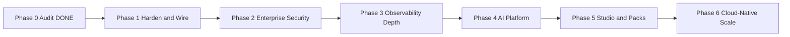

# OpsEdge360 — Frozen Product Roadmap

**Document ID:** OE360-ROADMAP-FROZEN-001  
**Status:** FROZEN  
**Effective:** 2026-07-10  
**Authority:** Phase 0 Audit approval with modifications  
**Change control:** Requires Product Owner + Chief Architect sign-off  

---

## Freeze statement

This six-phase roadmap is the **only authorized delivery sequence** until formally amended.  
No phase may start until the previous phase exit criteria are met and signed off.  
Every phase follows the permanent gate model in `PHASE_GATE_MODEL.md` (Planning → ADRs → Implementation → Unit → Integration → Security → Performance → **PRR** → Docs → Sign-off).  
All work must meet `DEFINITION_OF_DONE.md`.  
Production locks (domains, `trinetra360`, Nginx/SSL, volumes, migrations 001–014) remain in force across all phases.

---

## Guiding principles (frozen)

1. **Industry-agnostic core** — OpsEdge360 platform services must not embed vertical business logic.
2. **Solution packs are optional modules** — Banking360, Retail360, Healthcare360, Manufacturing360, and future verticals are **packs**, not core.
3. **Wire before invent** — Complete Sprint 0 hardening before net-new vision features.
4. **Secure by default** — Security enforcement precedes AI and Studio expansion.
5. **Runnable after every milestone** — Application remains deployable and backward compatible.
6. **Plan → ADR → Implement → Test → Security → Performance → PRR → Docs → Sign-off** — No production code without approved plan + ADRs; no next phase without PRR. See `PHASE_GATE_MODEL.md`.

---

## Six-phase roadmap

| Phase | Name | Primary goal | Est. duration | Depends on |
|-------|------|--------------|---------------|------------|
| **0** | Enterprise Audit | Baseline truth | Complete | — |
| **1** | Harden & Wire | Make Sprint 0 real, safe, documented | 2–3 weeks | Phase 0 approval |
| **2** | Enterprise Security | Enforce zero-trust (RBAC/ABAC/API keys/MFA path) | 3–4 weeks | Phase 1 exit |
| **3** | Observability Depth | Platform SRE + telemetry scale path | 3–4 weeks | Phase 2 exit |
| **4** | AI Platform | LLM Copilot, RCA, prompt registry, RAG | 4–6 weeks | Phase 3 exit |
| **5** | Studio & Packs | Dashboard/KPI/Report builders; white-label; modular packs | 6–8 weeks | Phase 4 exit |
| **6** | Cloud-Native Scale | Helm, CD, Vault, HA, OpenSearch, multi-region | Ongoing | Phase 5 exit |

---

## Phase summaries

### Phase 1 — Harden & Wire Sprint 0
Wire topology, pipeline, agent-config APIs through gateway; decide prod posture for scheduler/config-management; fix auth middleware & health probes; harden CI gates; document industry-agnostic pack boundary; **no Banking360 core coupling**.

### Phase 2 — Enterprise Security Enforcement
Gateway RBAC/ABAC, API keys, audit on mutations, Redis AUTH, rate limits, cookie/session hardening implementation, MFA design/spike.

### Phase 3 — Observability Depth / Platform SRE
Prod Prometheus/Grafana (or managed), real gateway metrics, log retention, sampling, load baselines.

### Phase 4 — Real AI Platform
Provider abstraction, prompt registry, grounded Copilot, evidence-based RCA, human-in-the-loop remediation.

### Phase 5 — Studio + Packs + White-label
Dashboard Studio, KPI/Report builders, metadata-driven industry & country packs (Banking360 as first optional pack), tenant branding.

### Phase 6 — Cloud-Native Scale
Installable Helm, CD, Vault/KMS, HA, OpenSearch, multi-region.

---

## Industry pack policy (frozen)

| Rule | Detail |
|------|--------|
| Core platform | Industry-agnostic (IT/OT/cloud/security/compliance engine) |
| Banking360 | **Optional solution pack** — not a required core service |
| Other verticals | Retail, Healthcare, Manufacturing, Telecom, Government, etc. as packs |
| Country packs | Metadata/rule-driven compliance packs (IN, US, UK, EU, …) |
| No duplicate code | Packs configure/extend core; they do not fork microservices |
| UI | Pack features appear only when pack is enabled for tenant |

---

## Development gate

| Gate | Requirement |
|------|-------------|
| Before Phase 1 code | Phase 1 Implementation Plan **approved** + Phase 1 ADRs **accepted** |
| Before Phase N code | Phase N−1 **PRR** PASS/PASS WITH CONDITIONS + Phase N plan + ADRs approved |
| Before Phase N final approval | PRR + docs review + role sign-off (`docs/reviews/`) |
| Production deploy | Change control + backup + smoke + rollback plan |

---

## Related frozen documents

- `docs/governance/FROZEN_PRODUCT_VISION.md`
- `docs/governance/FROZEN_ARCHITECTURE.md`
- `docs/governance/INDUSTRY_SOLUTION_PACKS.md`
- `docs/governance/PHASE_GATE_MODEL.md`
- `docs/governance/DEFINITION_OF_DONE.md`
- `docs/governance/DEFINITION_OF_READY.md`
- `docs/governance/RELEASE_GOVERNANCE_FRAMEWORK.md`
- `docs/governance/EXECUTIVE_ARCHITECTURE_BOARD.md`
- `docs/governance/CODING_STANDARDS.md`
- `docs/governance/RELEASE_CHECKLIST.md`
- `docs/governance/TECHNICAL_DEBT_REGISTER.md`
- `docs/governance/RISK_REGISTER.md`
- `docs/governance/DOCUMENTATION_STANDARD.md`
- `docs/governance/SECURITY_BASELINE.md`
- `docs/governance/PERFORMANCE_BASELINE.md`
- `docs/architecture/ARCHITECTURE_BASELINE_v1.0.md`
- `docs/phase1/PHASE1_IMPLEMENTATION_PLAN.md`
- `docs/reviews/PHASE1_PRODUCTION_READINESS_REVIEW.md`
- `docs/adr/` (Architecture Decision Records)
