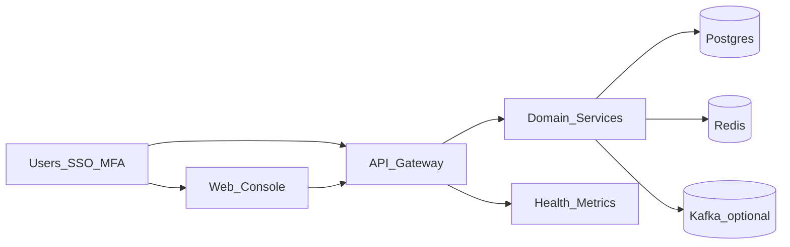

# Architecture Overview

## Product

OpsEdge360 is a modular enterprise digital operations platform: API gateway, web console, domain services (discovery, CMDB, observability, compliance, transactions, security, etc.), shared packages, and optional AI agents.

## Logical view

## Trust boundaries

- Edge TLS termination  
- JWT bearer auth (+ session `jti`)  
- Tenant scoping on data access  
- Demo plane outbound kill-switch when applicable  

## Deployment views

- **Compose:** full service mesh (primary pilot/production path)  
- **Helm:** gateway/web-centric Kubernetes entry (documented subset)  
- **Air-gap:** packaged images + verify scripts  

## Detailed docs

`docs/Wave9/ArchitectureGuide.md`, phase architecture notes, `docs/commercial/PLATFORM_OBSERVABILITY.md`.
