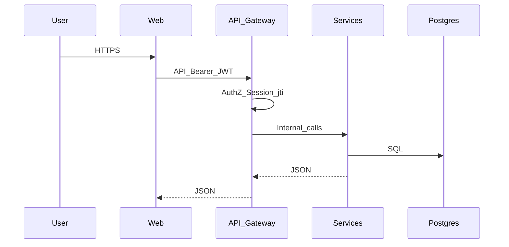
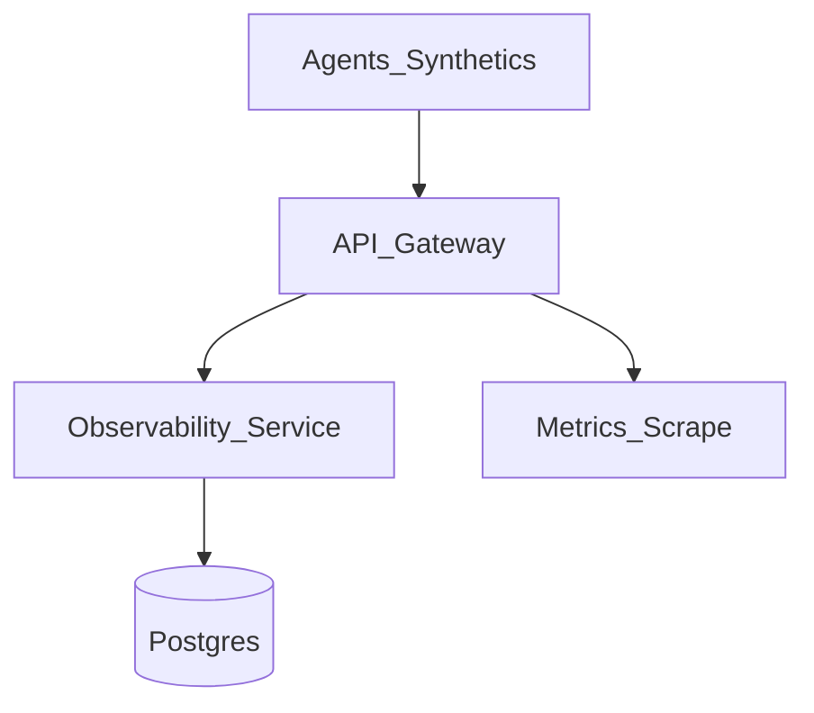

# Data Flow Diagrams

## Primary interactive flow

## Telemetry / ops flow (conceptual)

## Trust notes

- Secrets and passwords never logged in diagnostics bundles.  
- Demo environments may kill-switch outbound integrations.  
- Customer supplies IdP assertions over SSO flows.

Provide customer-specific IP/FQDN overlays during architecture review.
