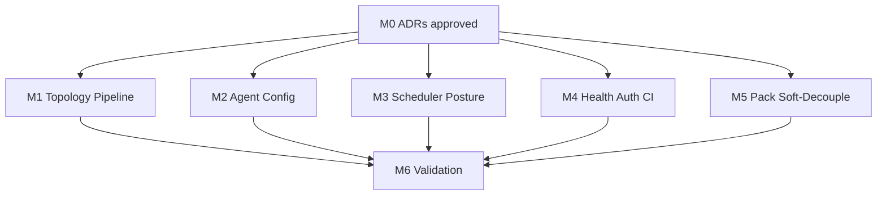

# Phase 1 Implementation Plan — Harden & Wire Sprint 0

**Document ID:** OE360-PHASE1-PLAN-001  
**Status:** DRAFT — AWAITING APPROVAL (no production code until approved)  
**Phase:** 1 of 6  
**Aligned roadmap:** `docs/governance/FROZEN_ROADMAP.md`  
**Estimated effort:** **88–112 person-hours** (≈ 2–3 calendar weeks, 1–2 engineers)  
**Production impact:** Additive only; production locks preserved  

---

## 1. Phase goal

Make Sprint 0 foundation **real, safe, and honest** in the production-compatible path:

1. Wire missing Sprint 0 APIs through the API gateway (topology, telemetry pipeline, agent config/updates).
2. Decide and document production posture for **scheduler** and **config-management**.
3. Fix critical auth/UX gates (password-reset middleware).
4. Replace hardcoded gateway health with dependency probes.
5. Harden CI security gate (blocking CRITICAL).
6. Soft-decouple **Banking360** from “core” navigation/docs (industry-agnostic policy).
7. Produce ADRs before any implementation; keep app runnable after every milestone.

**Out of scope for Phase 1:** RBAC enforcement (Phase 2), LLM/AI (Phase 4), Dashboard Studio (Phase 5), Helm/CD (Phase 6), MFA implementation, Vault.

---

## 2. Success / exit criteria

Phase 1 is complete when **all** are true:

| # | Exit criterion |
|---|----------------|
| E1 | `GET /api/v1/cmdb/topology/:type` and refresh proxied and documented |
| E2 | `GET/POST /api/v1/observability/pipeline/*` proxied and documented |
| E3 | Agent `config` + `updates` routes proxied (agent-key compatible) |
| E4 | ADR-003 decision implemented: scheduler/config-mgmt either in prod compose **or** explicitly marked non-prod with docs/CI alignment |
| E5 | Gateway `/api/v1/health` reflects real dependency checks (degraded when down) |
| E6 | `/forgot-password` and `/reset-password` reachable without auth cookie |
| E7 | Trivy CRITICAL findings fail CI (`exit-code: 1` for CRITICAL) |
| E8 | Banking360 documented as optional pack; nav labeled/gated per ADR-001 soft-decouple |
| E9 | `npm run lint && typecheck && test && build` pass; smoke script updated for new routes |
| E10 | Phase 1 test report + release notes + remaining backlog published |
| E11 | No changes to domains, `trinetra360`, Nginx SSL, volumes, migrations 001–014 |

---

## 3. Milestones

| Milestone | Name | Est. effort | Deliverables |
|-----------|------|-------------|--------------|
| **M0** | Plan & ADR acceptance | 8h | This plan approved; ADRs 001–008 accepted |
| **M1** | Gateway wire — topology & pipeline | 16–20h | Nest controllers + proxy methods + OpenAPI notes |
| **M2** | Gateway wire — agent config/updates | 12–16h | Public agent-key routes; backward compatible |
| **M3** | Scheduler & config-mgmt posture | 16–24h | Compose/docs/CI per ADR-003 |
| **M4** | Health, auth middleware, CI harden | 12–16h | Probes, middleware fix, Trivy gate |
| **M5** | Industry-agnostic soft-decouple | 8–12h | Nav/docs/feature flag stub per ADR-001 |
| **M6** | Validation & Phase 1 closeout | 12–16h | Tests, smoke, reports, commit milestones |

**Total:** 84–112h (M0 included).

---

## 4. Work breakdown structure (WBS)

### M0 — Governance (no code)

| Task ID | Task | Owner role | Deps | Est. |
|---------|------|------------|------|------|
| P1-M0-T1 | Review/approve this plan | PO + Architect | — | 2h |
| P1-M0-T2 | Accept ADRs 001–008 | Architect + Security + DevOps | T1 | 4h |
| P1-M0-T3 | Tag baseline `pre-phase1` | DevOps | T2 | 1h |
| P1-M0-T4 | Open Phase 1 tracking checklist | PM/Eng | T2 | 1h |

### M1 — Topology & pipeline gateway

| Task ID | Task | Deps | Est. | Acceptance |
|---------|------|------|------|------------|
| P1-M1-T1 | Add `ProxyService` methods for CMDB topology | ADR-002 | 2h | Unit/compile |
| P1-M1-T2 | Nest controller routes `/cmdb/topology/:type` (+ refresh) | T1 | 4h | Curl via gateway 200 |
| P1-M1-T3 | Proxy observability pipeline sources/ingest | ADR-002 | 3h | Compile |
| P1-M1-T4 | Nest controller `/observability/pipeline/*` | T3 | 4h | Curl via gateway |
| P1-M1-T5 | Update `docs/sprint0/SPRINT0_API.md` + OpenAPI notes | T2,T4 | 3h | Docs match reality |
| P1-M1-T6 | Smoke assertions for topology + pipeline | T2,T4 | 2h | Smoke green |

### M2 — Agent config / updates

| Task ID | Task | Deps | Est. | Acceptance |
|---------|------|------|------|------------|
| P1-M2-T1 | Proxy discovery agent config GET/PUT + updates GET | ADR-002 | 3h | Compile |
| P1-M2-T2 | Nest routes with `@Public()` + agent-key passthrough | T1, ADR-004 | 6h | Agent framework client works |
| P1-M2-T3 | Regression: existing heartbeat/metrics unchanged | T2 | 3h | Existing agent tests/smoke |
| P1-M2-T4 | Document agent config contract | T2 | 2h | Agent doc updated |

### M3 — Scheduler & config-management posture

| Task ID | Task | Deps | Est. | Acceptance |
|---------|------|------|------|------------|
| P1-M3-T1 | Implement ADR-003 decision (Option A or B) | ADR-003 | 8–16h | Compose/docs consistent |
| P1-M3-T2 | If Option A: Dockerfiles + prod compose + gateway proxy | T1 | 8h | Health on :4011/:4012 |
| P1-M3-T3 | If Option B: mark experimental; remove false API claims | T1 | 4h | Docs/CI honest |
| P1-M3-T4 | Migration 015 still applied via migrate job only | — | 1h | No edit 001–014 |

### M4 — Health, auth, CI

| Task ID | Task | Deps | Est. | Acceptance |
|---------|------|------|------|------------|
| P1-M4-T1 | Gateway health dependency probes | ADR-005 | 6h | Degraded when discovery down |
| P1-M4-T2 | Middleware public paths: forgot/reset | ADR-006 | 2h | Unauth access works |
| P1-M4-T3 | CI Trivy CRITICAL fail | ADR-007 | 2h | Pipeline fails on CRITICAL |
| P1-M4-T4 | Document cookie hardening plan (implement Ph2) | ADR-008 | 2h | ADR + backlog item |
| P1-M4-T5 | Optional: bind DB/Redis/Kafka to localhost in prod notes | ADR-007 | 2h | Runbook updated |

### M5 — Industry-agnostic soft-decouple

| Task ID | Task | Deps | Est. | Acceptance |
|---------|------|------|------|------------|
| P1-M5-T1 | Env/feature flag `PACK_BANKING360_ENABLED` (default true for backward compat) | ADR-001 | 3h | Flag read in web shell |
| P1-M5-T2 | Conditionally show Banking360 nav entry | T1 | 3h | Hidden when false |
| P1-M5-T3 | Update PRODUCT_IDENTITY + end-user docs | T2 | 2h | Pack language consistent |
| P1-M5-T4 | Note compliance `/banking360` as pack API (no route delete yet) | T3 | 2h | Doc only OK |

### M6 — Validation & closeout

| Task ID | Task | Deps | Est. | Acceptance |
|---------|------|------|------|------------|
| P1-M6-T1 | Full lint/typecheck/test/build | M1–M5 | 4h | Pass |
| P1-M6-T2 | Smoke + manual checklist | T1 | 4h | Pass |
| P1-M6-T3 | Phase 1 test/security/performance notes | T2 | 3h | Docs filed |
| P1-M6-T4 | Release notes + remaining backlog | T3 | 2h | Filed |
| P1-M6-T5 | Phase 1 exit sign-off | T4 | 1h | Signed |

---

## 5. Dependencies

| Dependency | Type | Notes |
|------------|------|-------|
| Production VPS access | External | Not required for laptop validation |
| Migration 015 | Soft | Already in branch; migrate job applies |
| Discovery/CMDB/Observability services | Hard | Must run for M1/M2 integration tests |
| ADR acceptance | Hard | Blocks all coding |
| Docker on CI | Soft | Image builds for M3 Option A |

---

## 6. Acceptance criteria (definition of done per change)

1. TypeScript strict compile clean for touched packages.  
2. No edits to migrations 001–014.  
3. Backward compatible: existing `/api/v1/discovery/agents/*/heartbeat` unchanged.  
4. Structured logging preferred for new gateway code; no new `console.log` in new files.  
5. Docs updated in same milestone as API changes.  
6. Commit only after milestone validation (per user commit policy).  
7. Runnable: `npm run build` succeeds after each milestone merge to feature branch.

---

## 7. Risks & mitigations

| ID | Risk | Likelihood | Impact | Mitigation |
|----|------|------------|--------|------------|
| R1 | Wiring orphan services exposes 502s in prod | Med | Med | ADR-003 Option B until ready; or add services before proxy |
| R2 | Agent config public routes widen attack surface | Med | High | Keep agent-key auth; rate-limit later (Ph2); no JWT bypass for user APIs |
| R3 | Health probes slow/cascade fail | Med | Med | Short timeouts; parallel probes; cached status |
| R4 | Trivy CRITICAL blocks all CI | Med | Med | Fix or waive with documented exception |
| R5 | Banking360 flag defaults break existing BFSI demo | Low | Med | Default `true` for backward compatibility |
| R6 | Scope creep into RBAC/AI | High | High | Hard out-of-scope list; defer to Ph2/Ph4 |
| R7 | Prod deploy without backup | Low | Critical | Enforce backup step in release notes |

---

## 8. Rollback strategy

| Scenario | Rollback |
|----------|----------|
| Gateway route bug | Revert gateway image/commit; Nginx unchanged |
| Compose adds scheduler/config and fails | Remove services from compose; `up -d` previous set |
| Migration 015 already applied | Leave tables (additive); code revert safe |
| Middleware change locks users out | Revert web image; confirm public paths |
| Feature flag hides Banking360 unexpectedly | Set `PACK_BANKING360_ENABLED=true` |

**Pre-change:** git tag `pre-phase1` + Postgres backup before any VPS deploy.  
**Never:** force-push main; edit 001–014; change domains/volumes/SSL.

---

## 9. Effort estimate summary

| Milestone | Low (h) | High (h) |
|-----------|---------|----------|
| M0 | 8 | 8 |
| M1 | 16 | 20 |
| M2 | 12 | 16 |
| M3 | 16 | 24 |
| M4 | 12 | 16 |
| M5 | 8 | 12 |
| M6 | 12 | 16 |
| **Total** | **84** | **112** |

Calendar: **2–3 weeks** with 1 senior full-stack + part-time reviewer.

---

## 10. Deliverables checklist (end of Phase 1)

- [ ] Updated architecture notes (wiring diagram)  
- [ ] API docs matching gateway  
- [ ] Test report  
- [ ] Security notes (agent routes, CI)  
- [ ] Performance notes (health probe overhead)  
- [ ] Deployment guide delta (compose posture)  
- [ ] Release notes  
- [ ] Remaining backlog → Phase 2  

---

## 11. Approval

| Role | Name | Decision | Date |
|------|------|----------|------|
| Product Owner | | ☐ Approve / ☐ Revise | |
| Chief Architect | | ☐ Approve / ☐ Revise | |
| Security Architect | | ☐ Approve / ☐ Revise | |
| DevOps / SRE | | ☐ Approve / ☐ Revise | |

**Production code for Phase 1 is forbidden until this table is signed Approve.**

---

## 12. Related ADRs (must be Accepted before coding)

| ADR | Title |
|-----|-------|
| [ADR-001](../adr/ADR-001-industry-agnostic-core-and-solution-packs.md) | Industry-agnostic core & solution packs |
| [ADR-002](../adr/ADR-002-sprint0-gateway-wiring.md) | Sprint 0 gateway wiring |
| [ADR-003](../adr/ADR-003-scheduler-config-mgmt-prod-posture.md) | Scheduler & config-mgmt prod posture |
| [ADR-004](../adr/ADR-004-agent-config-auth-model.md) | Agent config authentication model |
| [ADR-005](../adr/ADR-005-gateway-health-probes.md) | Gateway health dependency probes |
| [ADR-006](../adr/ADR-006-auth-middleware-public-routes.md) | Auth middleware public routes |
| [ADR-007](../adr/ADR-007-ci-security-gate.md) | CI security gate (Trivy) |
| [ADR-008](../adr/ADR-008-session-cookie-hardening.md) | Session cookie hardening (plan in Ph1, code in Ph2) |
