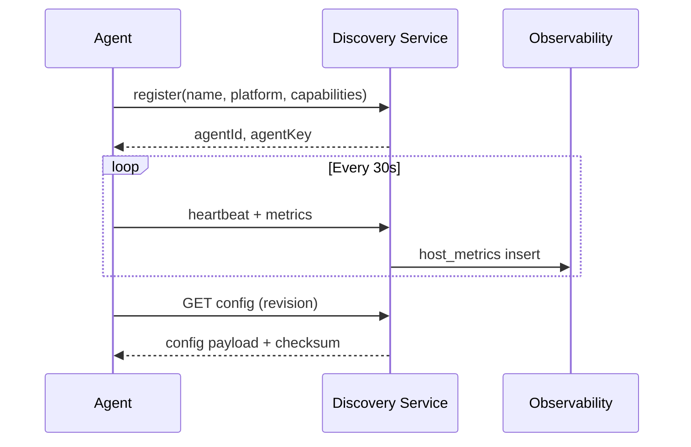

# Sprint 0 Agent Framework

## Architecture

```
packages/agent-framework/     # Shared TypeScript core
agents/
  windows-agent/              # WMI/WinRM metrics
  linux-agent/                # /proc, journald-ready
  mac-agent/                  # sysctl metrics
  docker-agent/               # docker stats
  kubernetes-agent/           # cgroup metrics
  host-agent/                 # Legacy (backward compatible)
```

## Capabilities

| Capability | Status |
|------------|--------|
| Agent Registration | Via discovery service |
| Heartbeat | Configurable interval |
| Secure Authentication | X-Agent-Key |
| Auto Update Framework | Update manifest endpoint |
| Configuration Pull/Push | Revision + checksum |
| Certificate Management | mTLS-ready CertificateManager |
| Compression | gzip for payloads >1KB |
| Offline Queue | Client-side with flush |
| Bandwidth Optimization | Compression + batch heartbeat |
| TLS / mTLS | Configurable cert paths |
| Plugin Architecture | PluginHost with sandbox levels |

## Configuration

See `agents/*/agent.env.example`:

```
API_URL=https://api.observability360.asoftechinsightz.com
AGENT_CAPABILITIES=host-metrics,heartbeat,config-pull,config-push,auto-update
COMPRESSION_ENABLED=true
TLS_VERIFY=true
```

## Deployment

```bash
npm run agent:linux
npm run agent:windows
npm run agent:docker
npm run agent:k8s
```

## Sequence Diagram


