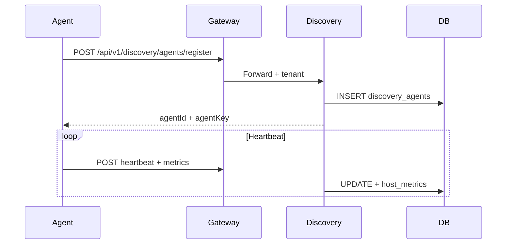
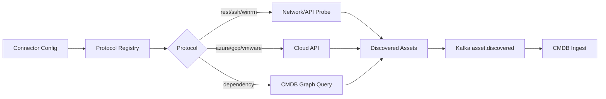

# Sprint 0 Architecture

## Layered Design

```
┌─────────────────────────────────────────────────────────────┐
│  API Gateway (NestJS) — /api/v1, JWT, tenant propagation    │
├─────────────────────────────────────────────────────────────┤
│  Microservices (Express/TS)                                 │
│  discovery | cmdb | observability | scheduler | config-mgmt │
├─────────────────────────────────────────────────────────────┤
│  Shared Packages                                            │
│  shared-db | event-bus | shared-logger | shared-security    │
│  agent-framework | plugin-sdk | shared-types                  │
├─────────────────────────────────────────────────────────────┤
│  Agents (platform-specific)                                 │
│  windows | linux | mac | docker | kubernetes                │
├─────────────────────────────────────────────────────────────┤
│  Infrastructure (LOCKED in production)                    │
│  PostgreSQL (trinetra360) | Redis | Kafka | Nginx           │
└─────────────────────────────────────────────────────────────┘
```

## Patterns

- **Clean Architecture / Hexagonal:** Services expose HTTP ports; domain logic in `*.service.ts`; repositories via `@opsedge360/shared-db`
- **DDD:** CMDB CI aggregates, discovery connectors as bounded contexts
- **CQRS:** Topology snapshots (write) vs graph queries (read)
- **Event-Driven:** Kafka topics for `asset.discovered`, `telemetry.received`
- **Repository Pattern:** `cmdb.repository.ts`, `scheduler.service.ts`
- **Zero Trust:** Agent `X-Agent-Key`, JWT for users, API key scopes, ABAC policies

## Service Ports

| Service | Port |
|---------|------|
| API Gateway | 4000 |
| Discovery | 4001 |
| CMDB | 4002 |
| Observability | 4003 |
| Scheduler | 4011 |
| Config Management | 4012 |

## Sequence: Agent Registration



## Flow: Discovery v2 Scan


