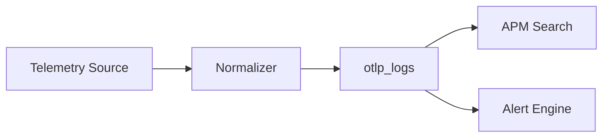

# Sprint 0 Telemetry Platform

## OpenTelemetry

| Signal | Endpoint | Storage |
|--------|----------|---------|
| Metrics | `POST /v1/metrics` | `prometheus_samples`, in-memory buffer |
| Logs | `POST /v1/logs` | `otlp_logs` |
| Traces | `POST /v1/traces` | `otlp_spans` |

## Features

- OTLP HTTP/JSON ingestion
- Rate limiting per tenant
- Trace correlation via trace/span IDs
- Context propagation in structured logs
- Semantic conventions via APM service
- Sampling configurable via `OTLP_RATE_LIMIT`
- Prometheus scrape + remote_write (existing)

## Collector Integration

Compatible with OpenTelemetry Collector export to OpsEdge360 observability service endpoints.

## Auto Instrumentation

Host agents push infrastructure metrics. APM service map built from OTLP spans.

## Health Endpoints

- `/health`, `/ready`, `/live`, `/metrics`

## Telemetry Pipeline (Module 4)

### Supported Sources

windows-event-log, linux-journald, syslog, application-log, nginx, apache, tomcat, weblogic, jboss, oracle, mysql, postgresql, mongodb, kafka, redis, rabbitmq, kubernetes-logs, docker-logs, aws-cloudwatch, azure-monitor, gcp-operations

### Pipeline Flow

### API

- `POST /pipeline/sources` — register source
- `POST /pipeline/ingest/:sourceId` — ingest raw payload

Normalization maps vendor formats to unified log records with severity, timestamp, and attributes.
